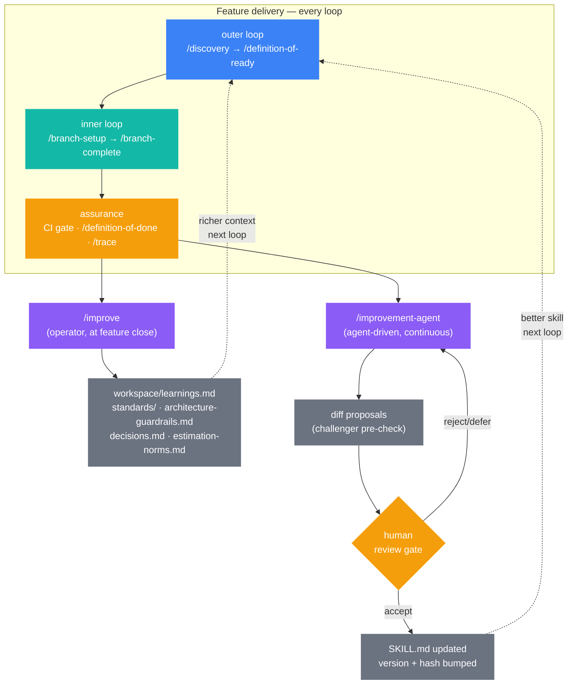
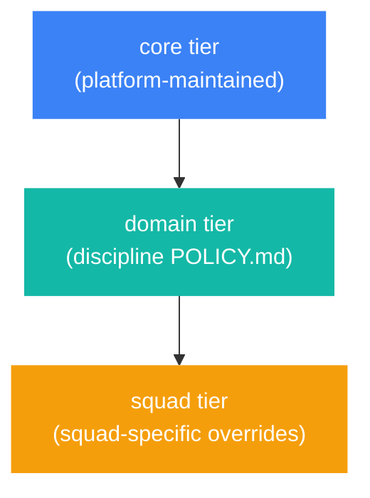

# Skills Platform


> Delivery standards, quality gates, and discipline practices encoded as versioned, hash-verified instruction sets. Executed by AI agents inside GitHub Copilot. Verified automatically on every PR. No hosted service required.

**Quick nav:** [Mission](#mission-and-intent) · [Problems](#problems-this-solves) · [Principles](#core-principles) · [Primitives](#primitives) · [Pipeline](#pipeline-overview) · [Skills](#skills-reference) · [Assurance](#assurance-and-traceability) · [Self-improving harness](#self-improving-harness) · [Standards](#standards-model) · [Surfaces](#delivery-surfaces) · [Status](#phase-delivery-status) · [Known gaps](#known-gaps) · [Getting started](#getting-started) · [Docs](#platform-documentation) · [ADRs](#architecture-decisions)

---

## Mission and intent

Software delivery governance is retrospective by default. Policy lives in documents. Standards are applied by humans under pressure with no closed loop between the rule and the decision made against that rule. When AI agents enter the delivery process, the same gap compounds at machine speed: thousands of decisions per hour, each inheriting an unverified governance context.

The skills platform closes that loop. Delivery standards, quality gates, compliance requirements, and discipline practices are encoded as versioned, hash-verified instruction sets — SKILL.md files — that agents execute against during delivery. Every governed action produces a structured trace committed to the repository. An automated CI assurance gate fires on every PR, verifies the instruction set hashes, and gates merge on the result. Governance becomes something that can be demonstrated from an artefact chain, not just attested by a human who was in the room.

Phase 1 and Phase 2 are complete and were built using the platform's own pipeline. 21 stories across two phases, four calendar days total. Phase 2 outer loop took 1 hour of operator focus time across 13 stories — the pipeline's own delivery signal is its primary capability demonstration.

---

## Audience and scale

**Developer or solo practitioner.** Run the outer loop unassisted: discovery through definition-of-ready in one sitting. The inner loop runs with GitHub Copilot in agent mode. No team configuration required.

**Squad of two to ten.** The progressive skill disclosure model loads skills at the phase boundary where they are needed, keeping context overhead manageable at any squad size. Each squad declares its delivery surfaces and active disciplines in `context.yml`.

**Platform maintainer or tech lead.** The fleet registry CI aggregation produces a cross-squad health summary. ADRs, standards updates, and skill versions are hash-verified alongside instruction sets.

**Regulated or multi-team organisation.** The approval-channel adapter routes DoR and DoD sign-offs to any configured tool (currently: GitHub Issue workflow). The standards model's POLICY.md floor pattern provides discipline-specific governance requirements that cannot be overridden below the floor. Non-engineer approvers do not need VS Code access.

---

## Problems this solves

**Governance is attested, not evidenced.** A team can say they followed the security standard. They cannot easily show which version of the standard was in-context when the code was written, or that the agent handling that decision was operating against that standard rather than a cached or hallucinated alternative. The skills platform writes a cryptographic hash of the instruction set into the trace at execution time. The hash is independently recomputable.

**AI agents widen scope without a mandate.** An agent given a task will complete adjacent tasks it perceives as related. There is no structural mechanism in most workflows to prevent a coding agent from touching files outside the agreed scope of a story. The DoR artefact's scope contract defines exact file touchpoints. The assurance gate checks that changed files at merge time match the declared contract.

**Updates break forks.** The original pattern for adopting a skills-based SDLC is to fork this repository. Once forked, any upstream improvement requires a manual pull and conflict resolution. The update channel is severed at fork time. The distribution model — delivered in Phase 1 — enables consumption and upstream sync without forking.

**Multi-surface delivery is ungoverned.** IaC, SaaS-API, SaaS-GUI, M365-admin, and manual delivery surfaces each have different DoD criteria, CI shapes, and assurance concerns. A governance model hardcoded to git-native delivery forecloses adoption for any squad not working in a VCS-native surface. The adapter model delivers correct governance for all six surface types from the same pipeline and skills library.

**Platform quality degrades over time without a feedback loop.** As the skill library grows, harness failures accumulate. Without a systematic mechanism to extract failure patterns from traces and propose SKILL.md improvements, the harness drifts from reality. The improvement agent — operational since Phase 2 — runs the improvement loop: trace query, pattern detection, diff proposal, challenger pre-check, and human review gate.

---

## Core principles

**Governance by demonstration.** Every governed action commits a structured trace entry to the repository with a verifiable instruction set hash. Governance is evidenced from the artefact chain, not recalled from memory or attested by a participant.

**The subset is the on-ramp.** Teams adopt the disciplines and skills relevant to their current delivery context. Progressive skill disclosure loads skills at the phase boundary where they are needed, keeping context overhead manageable as team scope expands.

**Surface-agnostic by contract.** The governance brain never branches on delivery surface type. All surface-specific complexity — DoD criteria, CI topology, artefact format — lives behind the surface adapter. The `execute(surface, context) → result` interface is the only constraint the brain needs.

**Spec immutability.** Once a DoR artefact is signed off, its scope contract cannot be changed without a new pipeline run. The coding agent cannot widen its own mandate mid-story. The `artefacts/` directory is read-only to the coding agent by instruction.

**Human approval at every gate.** DoR sign-off, assurance gate merge decision, and DoD confirmation all require a human signal. The platform automates verification; it does not automate judgment.

**Self-improving harness.** Every completed feature loop feeds back into the platform that ran it. `/improve` extracts reusable patterns from delivery and writes them to `workspace/learnings.md`, discipline standards, and architecture guardrails — making the next loop start with richer context. In parallel, the improvement agent reads delivery traces, detects failure patterns, proposes SKILL.md diffs, and gates every change on human review. Platform quality compounds across loops: more teams running more features produces more learnings, better skills, and fewer repeated failures. The harness trains itself from real production usage, not synthetic benchmarks.

---

## Primitives

| Primitive | Definition | What it is not |
|-----------|------------|----------------|
| **Skill** | A SKILL.md file encoding a complete delivery phase or discipline practice as a natural language instruction set. Versioned, hash-verified, loaded progressively at the phase boundary where needed. | Not a prompt template. Encodes expected behaviour, quality criteria, and the state-write contract for its phase. |
| **Surface adapter** | The interface between the governance brain and a delivery surface. All surface-specific complexity lives behind the adapter; the brain never branches on surface type. | Not a CI template. Governs any surface that implements the `execute(surface, context) → result` contract. |
| **Assurance gate** | Automated CI check on every PR. Verifies instruction set hashes, evaluates DoD criteria against the trace, and gates merge. Structurally independent from the delivery code it evaluates. | Not a linter or test runner. Evaluates governance compliance, not code correctness. |
| **Pipeline state** | `workspace/state.json` — the structured session record written at each phase boundary. Enables cross-session continuity: a new session reads state.json and resumes without verbal priming. | Not a project management ticket. The ground-truth handoff record between sessions. |
| **Eval suite** | `workspace/suite.json` — the living regression suite. Each entry guards a named failure pattern observed in real delivery. A scenario added must pass on every subsequent gate run. | Not a CI test suite in the app-testing sense. Guards harness behaviour, not application behaviour. |
| **Learnings log** | `workspace/learnings.md` — the structured record of delivery findings, failure patterns, and standards improvements written by `/improve` at feature close. Entries include date, context, evidence, and follow-on action. Accumulates across all features and surfaces to feed skills and standards improvements. | Not a retrospective or a personal note. Entries are evidence-backed findings sourced from the artefact chain, not from recall. |

---

## Pipeline overview

```mermaid
flowchart LR
    A["/discovery"]:::outer --> B["/benefit-metric"]:::outer
    B --> C["/definition"]:::outer
    C --> D["/review"]:::outer
    D --> E["/test-plan"]:::outer
    E --> F{DoR gate}:::gate
    F -->|signed off| G["/branch-setup"]:::inner
    G --> H["/implementation-plan"]:::inner
    H --> I["/tdd · subagent"]:::inner
    I --> J{verify}:::gate
    J -->|pass| K["/branch-complete"]:::inner
    K --> L{CI assurance gate}:::gate
    L -->|merge| M["/definition-of-done"]:::outer
    M --> N["/trace · /improve"]:::outer

    classDef outer fill:#3b82f6,color:#fff,stroke:none
    classDef inner fill:#14b8a6,color:#fff,stroke:none
    classDef gate fill:#f59e0b,color:#fff,stroke:none
```



| Loop | Steps | Who acts |
|------|-------|----------|
| Outer loop 🔵 | `/discovery` → `/definition-of-ready` | Operator + AI agent |
| Inner loop 🟢 | `/branch-setup` → `/branch-complete` | Coding agent (GitHub Copilot agent mode) |
| Assurance 🟡 | CI gate → `/definition-of-done` → `/trace` → `/improve` | Automated gate + operator review |

The outer loop produces fully specified, DoR-gated work items before any code is written. The inner loop consumes those items and produces implementation against a scope contract the agent cannot expand. The agent that defines requirements is not the agent that implements them.

---

## Skills reference

38 skills across four groups. `/workflow` is always safe to run — it surfaces current pipeline state and tells you which skill runs next.

### 🔵 Outer loop

| Skill | Purpose |
|-------|---------|
| `/workflow` | Pipeline navigator — surfaces current state; diagnoses stalled features |
| `/discovery` | Structures a raw idea or problem into a formal discovery artefact |
| `/clarify` | Identifies and closes the highest-value open questions blocking discovery |
| `/ideate` | Structured ideation using Torres, Cagan, and JTBD lenses |
| `/benefit-metric` | Defines measurable outcomes from an approved discovery artefact |
| `/metric-review` | Re-baselines benefit metrics at phase gates or on demand |
| `/definition` | Breaks approved discovery + benefit-metric into epics and stories |
| `/review` | Reviews story artefacts for quality, completeness, and traceability |
| `/decisions` | Records decisions, assumptions, and ADRs in a running log or formal entry |
| `/test-plan` | Writes failing tests and an AC verification script for a reviewed story |
| `/definition-of-ready` | Final gate check before the story is handed to the coding agent |
| `/spike` | Time-boxed investigation for unknowns blocking pipeline progress |
| `/estimate` | Records a phase-by-phase focus-time estimate at feature start (E1 — Rough Forecast), refines it when story count is known (E2 — Refined Estimate), and compares against actuals at /improve (E3 — Actuals Comparison). Feeds the cross-feature estimation norms table. |

### 🟢 Inner loop

| Skill | Purpose |
|-------|---------|
| `/branch-setup` | Creates isolated git worktree; verifies clean baseline before any code is written |
| `/implementation-plan` | Produces a task-by-task plan with exact file paths and TDD steps |
| `/subagent-execution` | Dispatches a fresh subagent per task with two-stage spec and quality review |
| `/tdd` | Enforces RED-GREEN-REFACTOR per task; no production code without a failing test |
| `/implementation-review` | Spec compliance then code quality review between task batches |
| `/systematic-debugging` | Four-phase root-cause process; no fix without root cause investigation first |
| `/verify-completion` | Evidence gate — runs verification command, reads full output, then makes the claim |
| `/branch-complete` | Completes the branch: final verify, four options (merge/PR/keep/discard), cleanup |

### 🟣 Post-merge and observability

| Skill | Purpose |
|-------|---------|
| `/definition-of-done` | Post-merge: validates the merged PR satisfies ACs and test plan |
| `/trace` | Validates the full traceability chain across all pipeline artefacts for a feature |
| `/coverage-map` | Visual coverage map across all stories: what is tested, where are the gaps |
| `/improve` | Extracts reusable patterns from delivery; writes back to standards and decisions |
| `/release` | Produces release notes, change request body, deployment checklist, rollback definition |
| `/record-signal` | Records a benefit metric signal outside of a `/definition-of-done` run |
| `/issue-dispatch` | Creates GitHub issues for DoR-signed-off stories to trigger the coding agent |
| `/persona-routing` | Routes DoR sign-off notifications to configured non-engineer approval channels |

### ⚙️ Platform governance

| Skill | Purpose |
|-------|---------|
| `/bootstrap` | Scaffolds the full pipeline structure in a new repository |
| `/improvement-agent` | Improvement loop: trace query → failure detection → diff proposal → challenger pre-check → human review |
| `/programme` | Programme-level navigator for multi-team initiatives across multiple workstreams |
| `/ea-registry` | Reads, queries, and maintains the enterprise application and interface registry |
| `/loop-design` | Defines the outer/inner loop delivery model for evolving the whole skill library |
| `/token-optimization` | Designs model routing and context budget strategy across the skill library |
| `/org-mapping` | Maps this pipeline to organisation-specific governance language and approval steps |
| `/scale-pipeline` | Operating model design for scaling the skill system from one to thirty teams |
| `/reverse-engineer` | Six-layer business rule and data contract extraction from legacy codebases |

---

## Assurance and traceability

The assurance loop runs automatically on every PR via the CI gate (`assurance-gate.yml`). It resolves the current instruction set hash from the skills registry, verifies that hash against the trace emitted during delivery, evaluates DoD criteria against the surface-adapted contract, and writes a gate verdict and trace hash to the PR comment. Merge is blocked on a failing verdict.

Each trace entry carries the skill name, hash, phase, verdict, and timestamp. The gate evaluates the PR, posts the verdict and trace hash as a PR comment, and uploads the trace as a workflow artefact. On merge, a separate `trace-commit.yml` workflow commits the trace to `workspace/traces/` on master — creating a permanent, in-git audit record alongside the merged code. Trace files are never committed to story or feature branches (see architecture guardrail). The watermark gate additionally checks that the eval suite pass rate meets the threshold and that the full score does not regress below the best recorded score for this skill/surface combination.

The T3M1 model audit assesses whether an independent non-engineer reviewer can answer eight governance questions from the trace alone, without engineering assistance. At Phase 2 close, three of eight questions are answered: Q1 (phase evident), Q3 (skill identified), Q4 (verdict present). Five questions — Q2 (standardsInjected hashes visible), Q5 (watermark result in PR), Q6 (stalenessFlag present), Q7 (agent independence evidenced by three structurally separate entries), Q8 (hash recomputation confirms no drift) — are Phase 3 delivery obligations. Independent T3M1 validation by a genuine non-engineering reviewer outside the platform engineering reporting line is a hard Phase 3 entry condition.

```jsonc
// workspace/traces/2026-04-11T21-33-02-002Z-ci-84f82370.jsonl — real Phase 2 gate run (PR #31)
// Entry 1 — gate started
{"status":"inProgress","trigger":"ci","prRef":"refs/pull/31/merge","commitSha":"f2581b0ee5075becdb9a727272b459f125bd7de5","startedAt":"2026-04-11T21:33:02.002Z"}
// Entry 2 — gate completed
{"status":"completed","trigger":"ci","prRef":"refs/pull/31/merge","commitSha":"f2581b0ee5075becdb9a727272b459f125bd7de5","startedAt":"2026-04-11T21:33:02.002Z","completedAt":"2026-04-11T21:33:02.003Z","verdict":"pass","traceHash":"85e4a239b856523f","checks":[{"name":"workspace-state-valid","passed":true},{"name":"pipeline-state-valid","passed":true},{"name":"artefacts-dir-exists","passed":true},{"name":"governance-gates-exists","passed":true}]}
```

---

## Self-improving harness

The platform improves itself from the delivery signal it produces. Every feature loop closes a feedback cycle that makes the next loop run better. Two distinct mechanisms route the signal back in.

### Human-driven improvement: `/improve` and `workspace/learnings.md`

At the close of every feature, `/improve` reads the full artefact chain — stories, test plans, DoD observations, trace entries, and estimation actuals — and extracts reusable patterns. Findings are written to:

- `workspace/learnings.md` — structured entries with date, context, evidence, root cause, and follow-on action. Persists across all features.
- `standards/[discipline]/core.md` — new MUST/SHOULD rules or refinements to existing ones.
- `.github/architecture-guardrails.md` — ADRs that should constrain future feature decisions.
- `workspace/estimation-norms.md` — actuals data rows for calibrating future estimates.

A new session entering the next feature reads `workspace/state.json` and `workspace/learnings.md` as part of its session-start orientation. The platform's institutional memory is concrete and versioned — it is not a verbal handoff.

### Agent-driven improvement: `/improvement-agent`

Running continuously against committed trace files, the improvement agent:

1. Queries `workspace/traces/` for failure patterns matching known detection signals.
2. Detects surface failures (skill-level), stale signals (metric drift), and overfitting (proposal applied too narrowly across variant contexts).
3. Generates diff proposals against SKILL.md files with full changelog rationale and confidence score.
4. Runs an anti-overfitting challenger pre-check — the proposal must generalise beyond the triggering trace set.
5. Presents accepted proposals for human review: approve, reject, or defer.

No SKILL.md change reaches production without a human approval gate.

### The scaling dynamic

A single team running a single loop produces a handful of learnings entries and a few trace signals. At ten teams running ten features per quarter, the improvement agent sees one hundred delivery cycles worth of failure patterns. The `/improve` extractions accumulate in `workspace/learnings.md` and standards files that every team receives at their next `/definition-of-ready`. The harness quality improves as a function of real collective usage — not of dedicated maintenance investment.

This is structurally different from a maintained documentation library. The loop between delivery and standards is closed inside the platform itself, not through a separate governance process or a quarterly review cadence.



---

## Current state vs structural controls

The platform today is operational and dogfooded. Not all of its assurance model is structurally enforced. This section documents what is currently manual-process assurance and what is now structural — and what the practical boundary is between the two.

### What is structural today

- **Artefact read-only constraint.** The `artefacts/` directory is protected by instruction (`pipeline.instructions.md` with `applyTo: "**"`). The coding agent cannot write to it without a deliberate override. This is a soft structural control — it depends on instruction compliance, not on a filesystem ACL or a CI hard block.
- **Scope immutability at DoR sign-off.** Once a DoR artefact is signed off, its scope contract cannot be changed without a new pipeline run. The assurance gate reads the DoR SHA and rejects any PR whose scope differs from the signed-off artefact.
- **Assurance gate CI.** Every PR runs `.github/workflows/assurance.yml`. The gate verifies instruction set hashes, evaluates DoD criteria against the trace, and refuses to merge if the verdict is not `pass`. This is a hard structural control — the gate exit code blocks merge.
- **Entitlements.** Repository branch protection, CODEOWNERS, and pipeline-state.json write permissions remain the only hard access controls on who can merge what. The platform does not replace these — it becomes the validated upstream chain that those controls protect downstream.
- **POLICY.md floors.** Injected into DoR artefacts at sign-off and verified by the assurance gate on every PR. A delivery that does not meet the floor requirements cannot merge. This is a hard structural control.

### What is process-assurance today (not yet structural)

- **DoR sign-off authority.** Who is allowed to sign off a DoR is currently enforced by process, not by a system access control. The platform records the sign-off event and timestamps it; it does not cryptographically verify that the signer holds the required role or entitlement.
- **T3M1 audit trail completeness.** At Phase 2 close, 3/8 audit questions are answered structurally. The remaining 5 require a qualified independent reviewer confirming that the pipeline chain they observe at runtime matches the committed artefacts. This is a manual assurance step, not a CI check.
- **Non-engineer approval channel.** The GitHub issue `/approve-dor` interface is built and wired; `process-dor-approval.js` writes `dorStatus` on receipt of the command. No live Jira/Confluence/Slack channel is configured. Until a real approver uses it in a live environment, this remains a tested-but-not-proven capability — process assurance, not structural.
- **Platform change governance.** From Phase 2 complete, all changes to `.github/skills/`, `.github/templates/`, `standards/`, and pipeline infrastructure must be merged via PR with platform team review. This is a policy control (enforced by convention and code review) pending a CODEOWNERS rule that hard-blocks direct-to-master commits on those paths.

### What the entitlements model means

The platform does not displace entitlements — it validates the chain upstream of the point where entitlements operate. A change that passes the assurance gate and is approved by an authorised reviewer has a machine-verifiable, end-to-end traceable chain from benefit hypothesis through story, test plan, DoR, implementation, and DoD. What entitlements protect is the act of merging that chain into production. The two controls are complementary, not alternatives.

For the first time, the chain from story → feature → initiative → benefit hypothesis is machine-traversable. A regulated auditor, a risk lead, or a compliance team can follow the chain from a production commit back to the original business justification without relying on verbal recall or a retrospective documentation effort. That traceability is the structural output the platform produces and the entitlements model protects.

---

## Conceptual lineage

This platform assembles and evolves ideas from several published sources. The novel contributions are called out explicitly at the end of this section.

| Source | Contribution |
|--------|-------------|
| [tikalk agentic-sdlc-spec-kit](https://github.com/tikalk/agentic-sdlc-spec-kit) | Original `/levelup` (now `/improve`) concept and CDR (Continuous Delivery of Requirements) extraction pattern. The skills pipeline here has evolved significantly in governance depth, multi-surface support, and fleet-scale architecture; the CDR extraction root is acknowledged. |
| Karpathy autoresearch loop | Mutable artefact + fixed harness model. The separation between the workspace (mutable, accumulating) and the harness (versioned, hash-verified) maps directly to the learnings.md + SKILL.md split. The `workspace/` convention follows this pattern. |
| Agent OS (Karpathy) | Standards injection before DoR — the idea that the agent's execution context is assembled from composable, domain-tagged standards at the phase boundary where they are needed, not passed as monolithic system prompts. The `standards/index.yml` routing table realises this pattern. |
| BMAD Method | Multi-agent role separation and bootstrap ceremony concepts. The outer-loop / inner-loop split — the agent that defines requirements is not the agent that implements them — is the BMAD separation realised in a governed pipeline. The `/bootstrap` ceremony maps to BMAD's project initialisation step. |
| OpenHarness (HKUDS) | Harness vocabulary and hook-based governance injection model. The assurance gate as a structurally independent CI hook that evaluates governance compliance (not code correctness) is the OpenHarness primitive. |
| NeoSigma auto-harness | Auto-growing eval set and regression watermark pattern. The `workspace/suite.json` eval suite — where every entry guards a named failure pattern and must pass on every subsequent gate run — follows this pattern. |
| AutoAgent (ThirdLayer) | Meta-agent / task-agent split validation and overfitting guardrail concept. The improvement agent's challenger pre-check (a proposal must generalise beyond the triggering trace set before it can be applied) is the AutoAgent anti-overfitting primitive. |
| Financial services maker/checker controls | Assurance independence primitive. The DoR sign-off and assurance gate CI are structurally independent from the delivery agent they evaluate — the same maker/checker separation used in regulated financial operations, applied to AI-delivered software. |
| IAM / entitlements model | Structural vs process controls framing. The distinction between what the platform validates (the upstream chain) and what entitlements protect (the act of merging) is a direct application of the separation-of-duties model from identity and access management. |

### What is novel (not derived from published sources)

- **Regulated-enterprise governance model.** The three-level assurance independence model (instruction identity, commit traceability, structurally independent gate verdict) assembled specifically for a Tier 1 financial services audit context. No published source covers this combination.
- **Three-tier standards inheritance.** Core (platform-maintained) → domain (discipline POLICY.md floor) → squad (squad-specific overrides without modifying platform files). The composition path and the POLICY.md floor-verification mechanism are original to this platform.
- **Delivery surface as a branching dimension.** The surface adapter contract (`execute(surface, context) → result`) that keeps the governance brain surface-agnostic while routing surface-specific DoD criteria, CI topology, and artefact format through the adapter. Five surfaces operational (see M2).
- **Benefit traceability at fleet scale.** The machine-traversable chain from production commit → story → feature → initiative → benefit hypothesis, queryable at fleet scale via `/trace` and the improvement agent. No published agentic SDLC framework has implemented this at the fleet level.
- **Dog-fooding constraint as governance signal.** The platform improves itself using the same pipeline it governs. The `/improve` skill, governed by the same PR policy it enforces, is the concrete realisation of this. The improvement agent's proposals are subject to the same human-review gate as any other platform change. This recursive governance structure is not derived from any single published source.

---

## Standards model

Discipline standards compose in three tiers. The core tier is platform-maintained and non-negotiable. The domain tier adds discipline-specific POLICY.md floors. The squad tier adds squad-specific configuration without modifying platform files.



> **Repo layout:** `standards/` is at the repo root (not under `docs/`) because SKILL.md files reference discipline paths such as `standards/[discipline]/core.md`. Moving it would require updating every skill path reference across the library. Human-readable reference documents live in `docs/`; machine-consumed instruction content stays at root depth.

**Currently live:** 3 core disciplines (software-engineering, security-engineering, quality-assurance) with full POLICY.md floors delivered in Phase 1. 8 additional domain-tier discipline standards delivered as pilots in Phase 2 (p2.9). `standards/index.yml` is the composition routing table. The composition path is: core → domain extension → squad specification → POLICY.md validation → injected as one composed standards document.

### How standards injection works

Each discipline directory under `standards/` contains two files:

- **`core.md`** — the full set of requirements for that discipline (MUST / SHOULD / MAY). Written as actionable rules the agent follows during delivery. Example: `standards/software-engineering/core.md` requires atomic-replace writes for mutable state files, platform-guarded test scripts, and dependency manifest pinning.
- **`POLICY.md`** — the binary floor for that discipline. Three to five requirements lifted from `core.md` that are non-negotiable regardless of domain or squad context. Any delivery that does not meet the floor requirements fails the assurance gate. Example: `standards/software-engineering/POLICY.md` requires a passing automated test suite before PR merge, pinned dependency manifests, and a decision log entry for every architectural decision.

**When and how injection occurs:**

At `/definition-of-ready`, the skill reads `standards/index.yml` to identify which disciplines apply to the story's declared surfaces and domains. For each matched discipline, it reads the corresponding `core.md` and `POLICY.md` files and appends the full text to the **Coding Agent Instructions block** inside the DoR artefact. The coding agent executing the story receives these standards as part of its work specification — the same artefact-first orientation that prevents scope drift. There is no runtime call to a standards service; the standards are committed text in the repository, hash-verifiable at any point.

**What the POLICY.md floor enforces:**

POLICY.md floors are checked by the assurance gate CI on every PR. The gate reads the DoR artefact, extracts the injected POLICY.md blocks, and verifies that the PR's test results, manifest files, and trace entries satisfy every floor requirement. A PR that fails a floor requirement cannot merge — the gate exit code is non-zero.

**Extending the standards:**

Add a new discipline by creating `standards/[discipline]/core.md` and `standards/[discipline]/POLICY.md`, then adding the discipline to `standards/index.yml` with its surface and domain routing keys. Existing floor requirements in any checked-in POLICY.md cannot be relaxed without a pipeline evolution cycle (new story, new DoR, new assurance gate test). Domain and squad tiers may add requirements on top of the floor; they may not remove any floor requirement.

---

## Delivery surfaces

All six surface types have a delivered adapter. Declare your surface in `.github/context.yml`; the platform resolves the correct DoD criteria, CI topology, and artefact format from there.

| Surface | Description | Adapter |
|---------|-------------|---------|
| git-native | VCS-based delivery (GitHub, GitLab, Bitbucket) | ✅ |
| IaC | Infrastructure-as-code (Terraform, Bicep, CloudFormation) | ✅ |
| SaaS-API | API-driven SaaS configuration and integration | ✅ |
| SaaS-GUI | GUI-driven SaaS configuration | ✅ |
| M365-admin | Microsoft 365 tenant administration | ✅ |
| manual | Manual procedure (runbook, checklist, sign-off) | ✅ |

Path A (EA registry surface type resolution via `/ea-registry`) and Path B (`context.yml` explicit declaration) are both permanently valid. Bitbucket CI YAML validators are delivered. Docker Compose DC environment tests for three ACs (app-password, OAuth, SSH) are deferred pending a DC environment (`PREREQ-DOCKER`).

---

## Fleet and multi-team operation

Each squad runs the platform in their own repository with their own `pipeline-state.json`. The fleet registry CI aggregation (p2.7) produces cross-squad health summaries by reading per-squad state files. Persona routing (p2.8) gives non-engineer approvers a sign-off surface in their native tooling. The approval-channel adapter (ADR-006) is the extension point for adding new approval surfaces.

---

## Phase delivery status

| Phase | Stories | Outer loop focus | Calendar days | Status |
|-------|---------|-----------------|---------------|--------|
| Phase 1 — Foundation, distribution, self-improving harness | 8 | 13h | 2 | ✅ Complete |
| Phase 2 — Scale, observability, full adapter model | 13 | 1h | 2 | ✅ Complete |
| Phase 3 — Governance hardening, T3M1, cross-team autoresearch | TBD | TBD | TBD | ⏳ Design phase (T3M1 3/8 outstanding) |
| Phase 4 — Operational domains, agent identity, policy lifecycle | TBD | TBD | TBD | ⏳ Not started |

Phase 2 outer loop focus time (1h) reflects high pipeline fluency at Phase 2 start and an engagement fraction of approximately 25%. Confidence on that figure is medium-low — it is not a reliable planning baseline for new teams.

---

## Known gaps

> ⚠️ **T3M1 audit readiness: 3/8.** Five of eight independent audit questions (Q2, Q5, Q6, Q7, Q8) are unanswered at Phase 2 close. The platform cannot be described as audit-ready for regulated enterprises until all 8 are answered and an independent non-engineering T3M1 evaluation is on record in `MODEL-RISK.md`. These are Phase 3 delivery obligations.

> ⚠️ **Non-engineer approval: single channel.** Persona routing currently supports the GitHub Issue workflow only (ADR-006). Teams using Jira, Confluence, or Slack-native approval workflows require a new approval_channel adapter before non-engineer sign-offs can be routed to those surfaces.

> ⚠️ **Phase 2 E3 confidence: medium-low.** Outer loop focus time of 1h across 13 stories was derived at ~25% engagement fraction. The signal is real but the hours figure is not suitable as a planning baseline without independent corroboration from a second team.

> ⚠️ **Windows trace validator missing.** `scripts/validate-trace.sh` requires bash and Python 3 and fails in PowerShell-only environments. A Windows-native `validate-trace.ps1` is a Phase 3 candidate.

---

## Getting started

1. **Sync or fork this repository** into your project. The sync script preserves hash verification integrity: `scripts/sync-from-upstream.sh` (Linux/macOS) or `scripts/sync-from-upstream.ps1` (Windows).

2. **Configure your context.** Copy `contexts/personal.yml` to `.github/context.yml` and fill in your delivery surface, VCS platform, CI platform, and toolchain settings. The file has inline documentation for each field.

3. **Run the baseline check.** `npm test` — five governance checks, zero external dependencies. This must pass on a clean copy before you start work.

4. **Start the pipeline.** Open GitHub Copilot Chat and type `/workflow`. It will surface the current pipeline state and tell you which skill to run first.

<details>
<summary>Enterprise and multi-surface setup</summary>

**Custom CI:** Replace `.github/workflows/assurance-gate.yml` with your CI platform equivalent. Bitbucket Pipelines YAML validators are in `tests/`. Ensure your gate runs `npm test` and `validate-trace.sh --ci` before invoking the agent.

**Multiple delivery surfaces:** Declare `delivery-surface: [git-native, iac]` in `context.yml`. The `/discovery` skill will create separate DoD gates per surface type when writing stories.

**Standards extension:** Add POLICY.md files to `standards/[discipline]/` and update `standards/index.yml`. Core tier floors in existing POLICY.md files cannot be overridden below the stated minimum.

**Non-engineer approvals:** Set `tools.approval_channel: github-issue` in `context.yml` and run `/persona-routing` to configure the sign-off workflow. Other channel adapters require implementing the ADR-006 interface.

**Agent instructions format:** Set `vcs.type` in `context.yml` to control whether the assembly script emits `.github/copilot-instructions.md` (GitHub) or `AGENTS.md` (vendor-neutral default for Jenkins, Bitbucket, and other non-GitHub surfaces) — per ADR-005.

**Jenkins/Bitbucket CI gate adapter:** Replace `assurance-gate.yml` with an equivalent Bitbucket Pipelines or Jenkins declarative pipeline. Reference validators are in `tests/check-bitbucket-cloud.js` and `tests/check-bitbucket-dc.js`. Full adapter parity (including Docker Compose Bitbucket DC tests) is a Phase 3 delivery.

**Jira / Teams approval channel:** Implement the ADR-006 `approval_channel` interface for your organisation's tool and declare it in `context.yml`. The GitHub Issue adapter is the Phase 2 reference implementation; Jira and Teams channel adapters are Phase 3 delivery items.

</details>

---

## Architecture decisions

| ADR | Decision | Status |
|-----|----------|--------|
| ADR-001 | `pipeline-viz.html` is a single self-contained file; no external runtime dependencies. Parallel extraction (`viz-functions.js`) for testability; browser inline functions untouched. | Active |
| ADR-002 | Governance gates must use evidence fields, not stage-proxy — stage alone cannot pass a gate | Active |
| ADR-003 | `standards/index.yml` uses a schema-first model; prompt hash verification is the primary audit signal — hash is stored in the trace at execution time | Active |
| ADR-004 | All tool and channel integrations are declared in `.github/context.yml`; no hardcoded provider values in skills or scripts | Active |
| ADR-005 | Agent instructions format (copilot-instructions.md vs AGENTS.md) is a surface adapter concern driven by `vcs.type` in context.yml; AGENTS.md is the vendor-neutral default | Active |
| ADR-006 | Non-engineer approval routing is an adapter pattern (`approval_channel`); first implementation is the GitHub Issue workflow | Active |
| ADR-011 | Artefact-first: new SKILL.md files, `src/` modules, and governance check scripts require a story artefact before or alongside the commit; retrospective path available via `retrospective-story.md` template | Active |

Full decision history: [`.github/architecture-guardrails.md`](.github/architecture-guardrails.md) · [HANDOFF.md](docs/HANDOFF.md)

---

## Platform documentation

All human-readable reference documents live in `docs/`. Machine-consumed instruction content (SKILL.md files, standards, governance gates) stays at root depth — see the Standards model section for the layout rationale.

| Document | Purpose |
|----------|---------|
| [ONBOARDING.md](docs/ONBOARDING.md) | Squad onboarding guide — step-by-step setup, required reading list, and first-run checklist |
| [HANDOFF.md](docs/HANDOFF.md) | Session handoff and context recovery — how to resume work across sessions without a verbal briefing |
| [MODEL-RISK.md](docs/MODEL-RISK.md) | Model risk register — T3M1 audit questions, risk ratings, and the 2026-04-16 artefact coverage audit record |
| [validation-playbook.md](docs/validation-playbook.md) | AC verification playbook — how to run the plain-language AC verification scripts produced by `/test-plan` |
| [skill-pipeline-instructions.md](docs/skill-pipeline-instructions.md) | Full pipeline instructions reference — the complete sequence of skills, entry conditions, and exit conditions |
| [feature-additions.md](docs/feature-additions.md) | Feature additions log — a record of capabilities added between formal story cycles |

---

## Contributing

This repository is built using its own pipeline. To contribute a skill improvement or standards update:

1. Run `/discovery` to scope the change.
2. Follow the full pipeline through to DoR sign-off before writing any code.
3. Open a PR as a draft. Do not mark ready for review. Do not merge.
4. The assurance gate runs automatically on PR open. A failing gate is a failing contribution — identify the root cause using `/systematic-debugging`, do not bypass the gate.

The `artefacts/`, `.github/skills/`, `.github/templates/`, and `.github/governance-gates.yml` directories are read-only to the coding agent. Changes to these require a pipeline run, not a direct edit.

---

<hr>

Built with the skills platform's own pipeline — 21 stories, 4 calendar days.

[Onboarding](docs/ONBOARDING.md) · [Handoff](docs/HANDOFF.md) · [Model risk](docs/MODEL-RISK.md) · [Validation playbook](docs/validation-playbook.md) · [Pipeline instructions](docs/skill-pipeline-instructions.md) · [Feature additions](docs/feature-additions.md) · [Architecture decisions](.github/architecture-guardrails.md)
