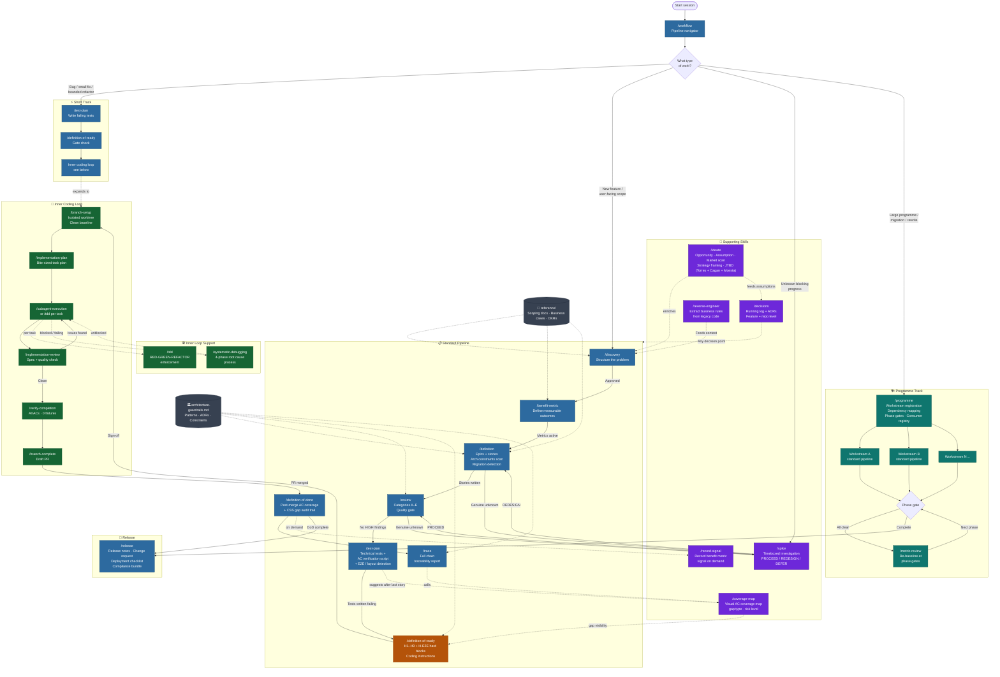
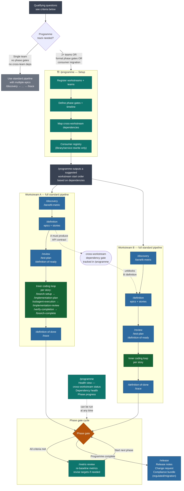

# Skills Pipeline

An agentic SDLC pipeline for GitHub Copilot. Structures the full software delivery lifecycle — from raw idea through to production release — using a set of Copilot skills that enforce quality gates, produce traceable artefacts, and route work to the coding agent only when it is properly defined.

Designed to work for a single developer shipping a small feature and equally for a large multi-team programme running a 2-year migration.

---

## Pipeline flow



---

## How it works

Each skill is a `SKILL.md` file with YAML frontmatter that Copilot uses for automatic invocation. You say a natural phrase — "I have an idea", "review the stories", "is this story ready" — and the right skill activates. Each skill asks clarifying questions, produces a structured artefact, and tells you exactly what to do next.

All artefacts are saved to `.github/artefacts/[feature-slug]/` so nothing lives only in a chat window.

---

## Tracks

### Short track
For bugs, small fixes, and bounded refactors. Three steps.
```
/test-plan → /definition-of-ready → inner coding loop
```

### Standard pipeline
For new features and user-facing scope.
```
/discovery → /benefit-metric → /definition → /review → /test-plan → /definition-of-ready → inner coding loop → /definition-of-done → /trace
```

**Inner coding loop** (expands Step 7):
```
/branch-setup → /implementation-plan → /subagent-execution (or /tdd per task) → /verify-completion → /branch-complete
```
Support skills throughout: `/tdd`, `/systematic-debugging`, `/implementation-review`

### Programme track
For large initiatives, multi-team migrations, library rewrites, and multi-phase programmes. Runs the **full standard pipeline per workstream** (including the inner coding loop per story) with a coordination layer above.

**Use the programme track only when at least one of these signals applies:**

| Signal | Threshold |
|--------|----------|
| Multiple teams | 2 or more separate delivery teams |
| Cross-team hard dependencies | One team cannot start until another delivers a specific artefact or contract |
| Formal phase gates | Stakeholder, governance, or regulatory sign-off required before proceeding |
| Consumer migration | Shared service or library being replaced with downstream adopters |
| Multi-phase timeline | Delivery spans more than one quarter with interim checkpoints |

If none of these apply, use the standard pipeline with multiple epics — `/definition` handles that natively without the coordination overhead.

```
/programme (setup + qualification) → [per workstream: full standard pipeline] → /metric-review at phase gates
```

**Programme track — detailed flow:**



When in doubt about which track, run `/workflow` — it will route you.

---

## Skills

| Skill | Purpose | When to use |
|-------|---------|-------------|
| `/workflow` | Pipeline navigator and diagnostic | Start of every session; "what's next"; "why is this stuck" |
| `/discovery` | Structures a raw idea into a formal artefact | "I have an idea"; "we should build"; "there's a problem with" |
| `/benefit-metric` | Defines measurable success metrics | After discovery is approved |
| `/definition` | Breaks discovery into epics and stories | After benefit-metric is active |
| `/review` | Quality gate — finds gaps before test-writing | After stories exist |
| `/test-plan` | Writes failing tests + AC verification script; detects browser-layout-dependent ACs that can't be verified in Jest/jsdom | After review passes |
| `/definition-of-ready` | Pre-coding gate — H1–H9 + H-E2E hard blocks; produces coding agent instructions | After test plan exists |
| `/branch-setup` | Creates isolated worktree, verifies clean baseline | After DoR sign-off |
| `/implementation-plan` | Writes bite-sized task plan from DoR + test plan | After branch ready |
| `/tdd` | RED-GREEN-REFACTOR enforcement per task | During any implementation task |
| `/subagent-execution` | Dispatches fresh subagent per task with two-stage review | When plan exists and subagents available |
| `/implementation-review` | Spec + quality review between task batches | Between tasks or before PR |
| `/verify-completion` | Evidence gate — run tests + walk ACs before claiming done | Before opening a PR |
| `/systematic-debugging` | 4-phase root cause debugging process | When any task or test gets stuck |
| `/branch-complete` | Opens a draft PR or merges locally; cleans up worktree | After verify-completion passes |
| `/definition-of-done` | Post-merge AC coverage validation; CSS-layout gap audit trail | After PR is merged |
| `/coverage-map` | Visual coverage map across all stories — what's tested, by what kind of test, where the gaps are | After test plans exist; suggested by `/workflow`; called by `/trace` |
| `/trace` | Full chain traceability report; flags CSS-layout gaps without RISK-ACCEPT | On demand or CI on PR open |
| `/record-signal` | Records a benefit metric signal without a full DoD run | When measurement data is available: "we got data", "record a signal" |
| `/decisions` | Records ADRs and in-flight decisions | At any pipeline decision point |
| `/ideate` | Structured product discovery — five lenses: opportunity mapping, assumption inventory, market scan, product strategy framing (Torres + Cagan), and jobs-to-be-done (Christensen / Moesta). Suggests lenses based on current pipeline stage and artefacts | Run at any point: blank-slate exploration, enrich an active discovery, or stress-test assumptions before definition |
| `/spike` | Timeboxed investigation for genuine unknowns | When a step is blocked by something unknown |
| `/reverse-engineer` | Extracts business rules from legacy code | When modernising or replacing a legacy system |
| `/programme` | Programme-level navigator for multi-team work | Large initiatives, migrations, library rewrites |
| `/metric-review` | Re-baselines benefit metrics at phase gates | Quarterly, at phase gates, or when targets are questioned |
| `/release` | Produces release notes, change request, deployment checklist | When stories are DoD-complete and ready to ship |
| `/bootstrap` | Scaffolds this pipeline in a new repository | First time setup |

---

## Templates

All structured artefacts conform to templates in `.github/templates/`. Skills reference templates — they never embed format blocks inline.

| Template | Used by |
|----------|---------|
| `epic.md` | `/definition` |
| `story.md` | `/definition` — standard user-facing stories |
| `migration-story.md` | `/definition` — migration, cutover, parallel-run, consumer migration stories |
| `benefit-metric.md` | `/benefit-metric` |
| `discovery.md` | `/discovery` |
| `test-plan.md` | `/test-plan` |
| `ac-verification-script.md` | `/test-plan` |
| `definition-of-ready-checklist.md` | `/definition-of-ready` |
| `review-report.md` | `/review` |
| `definition-of-done.md` | `/definition-of-done` |
| `trace-report.md` | `/trace` |
| `decision-log.md` | `/decisions` |
| `architecture-guardrails.md` | `/review` (Category E), `/definition` (Step 1.5), `/definition-of-ready` (H9) |
| `reference-index.md` | `/discovery`, `/benefit-metric`, `/definition` — indexes source documents |
| `consumer-registry.md` | `/programme` — tracks adoption for library/service rewrites |
| `coverage-map.md` | `/coverage-map` — coverage map artefact (per-AC detail + gap register) |
| `ideation.md` | `/ideate` — opportunity map, assumption inventory, market scan, strategy framing |
| `release-notes-technical.md` | `/release` |
| `release-notes-plain.md` | `/release` |
| `change-request.md` | `/release` |
| `deployment-checklist.md` | `/release` |
| `reverse-engineering-report.md` | `/reverse-engineer` |
| `vendor-qa-tracker.md` | `/reverse-engineer` |

---

## Artefact storage

```
.github/artefacts/[feature-slug]/
  reference/                        ← source documents (scoping decks, business cases, OKRs)
    reference-index.md
  discovery.md
  benefit-metric.md
  decisions.md
  epics/
  stories/
  review/
  test-plans/
  verification-scripts/
  dor/
  dod/
  trace/
  coverage/                         ← generated by /coverage-map
    coverage-map.md
    coverage-map.html
  research/                         ← generated by /ideate
    ideation.md
```

For programme-track work, the programme artefact and consumer registry live at:
```
.github/artefacts/[programme-slug]/
  programme.md
  consumer-registry.md             ← library/service rewrite programmes only
```

---

## Architecture governance

`.github/architecture-guardrails.md` is the live source of truth for:
- Pattern library and style guide references
- Reference implementations
- Approved patterns and anti-patterns
- Mandatory constraints (security, accessibility, data, observability)
- Repo-level ADR register

Skills that enforce it: `/review` (Category E), `/definition` (Step 1.5), `/definition-of-ready` (H9 hard block), `/trace` (compliance check), and the coding agent instructions block.

---

## Pipeline visualiser

`.github/pipeline-viz.html` is a single-file SPA that reads `pipeline-state.json` and renders the current state of every feature in the pipeline.


**Views:**
- **Stage view** — feature cards arranged by pipeline stage, with health colour, test progress bar, task progress bar, and loop score badge
- **Outcomes view** — per-feature benefit panels showing each metric, signal status (🟢 on-track / 🟡 at-risk / 🔴 off-track), evidence, and contributing stories

**Features:**
- Keyboard shortcut `o` toggles the Outcomes view
- Inline metric editing — click ✏️ Edit on any metric row to update signal, evidence, and date
- ⬇ Download button exports the updated `pipeline-state.json` (turns green when unsaved edits exist)
- Auto-polls `pipeline-state.json` every 10 seconds **only while a pipeline is actively running** (a feature at `branch-setup`, `implementation-plan`, `subagent-execution`, or `verify-completion`) — the timer stops itself when no active features remain, so there is zero overhead at rest

**Running it:**
Open with VS Code Live Server or any local HTTP server. Works on GitHub Pages. Falls back to a file-drop zone when opened directly from `file://` (fetching local files is blocked by browsers).

---

## Setting up in a new repository

Open Copilot in agent mode and run:

```
/bootstrap
```

This creates all skill files, templates, `copilot-instructions.md`, and the artefacts directory. It will ask for two things at the end: a product context paragraph and your coding standards. Takes around 5–10 minutes.

---

## Pipeline quality gates

| Gate | Skill | Blocks |
|------|-------|--------|
| Discovery approved | Human review | `/benefit-metric` |
| No HIGH review findings | `/review` | `/test-plan` |
| All ACs covered by tests | `/test-plan` | `/definition-of-ready` |
| CSS-layout-dependent ACs resolved (E2E, manual+RISK-ACCEPT, or rewrite) | `/test-plan` Step 3a | `/definition-of-ready` H-E2E |
| H1–H9 + H-E2E hard blocks passed | `/definition-of-ready` | Coding agent |
| AC coverage confirmed | `/definition-of-done` | `/release` |
| Chain health reported | `/trace` | (informational — MEDIUM finding if CSS gaps unaccepted) |
| Phase gate metric review | `/metric-review` | Programme phase progression |

---

## Repo structure

```
.github/
  copilot-instructions.md          ← master config loaded into every Copilot interaction
  pull_request_template.md         ← PR checklist with AC and chain traceability fields
  architecture-guardrails.md       ← live guardrails file (create from template)
  pipeline-viz.html                ← pipeline visualiser (open in browser with a local server)
  skills/                          ← 27 skill SKILL.md files
  templates/                       ← 23 artefact templates
  scripts/                         ← generated helper scripts (e.g. coverage-map.js)
  artefacts/                       ← generated pipeline artefacts (one folder per feature)
```
