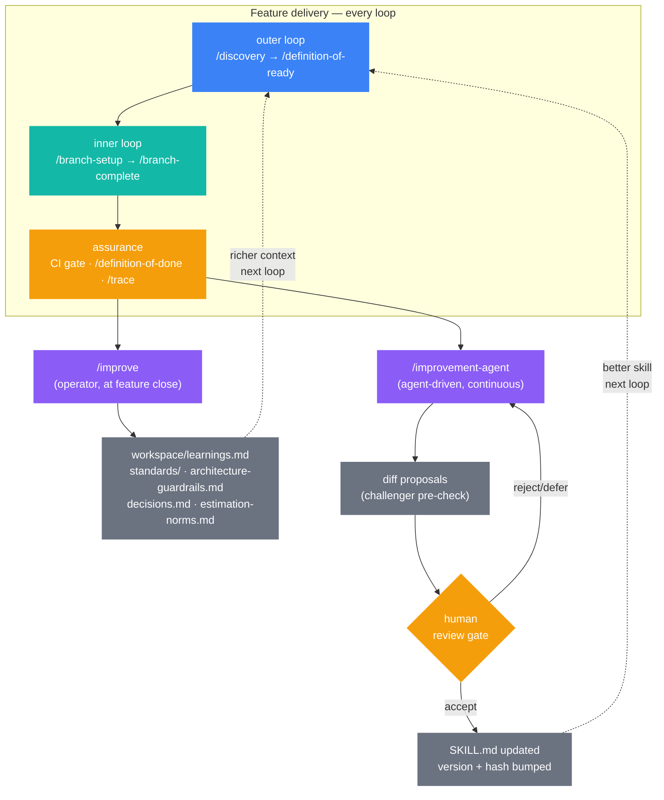
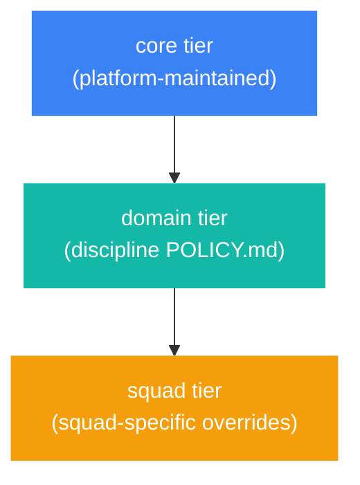

# Skills Platform


> Delivery standards, quality gates, and discipline practices encoded as versioned, hash-verified instruction sets. Executed by AI coding agents — Claude Code, GitHub Copilot, or any agent that can read a SKILL.md file and call tools. Verified automatically on every PR. No hosted service required.

**Quick nav:** [Mission](#mission-and-intent) · [Problems](#problems-this-solves) · [Principles](#core-principles) · [Primitives](#primitives) · [Pipeline](#pipeline-overview) · [Skills](#skills-reference) · [Assurance](#assurance-and-traceability) · [Self-improving harness](#self-improving-harness) · [Model eval](#model-evaluation-capability) · [Standards](#standards-model) · [Surfaces](#delivery-surfaces) · [Web UI](#web-ui-execution-layer) · [Status](#phase-delivery-status) · [Known gaps](#known-gaps) · [Getting started](#getting-started) · [Docs](#platform-documentation) · [ADRs](#architecture-decisions)

---

## Mission and intent

Software delivery governance is retrospective by default. Policy lives in documents. Standards are applied by humans under pressure with no closed loop between the rule and the decision made against that rule. When AI agents enter the delivery process, the same gap compounds at machine speed: thousands of decisions per hour, each inheriting an unverified governance context.

The skills platform closes that loop. Delivery standards, quality gates, compliance requirements, and discipline practices are encoded as versioned, hash-verified instruction sets — SKILL.md files — that agents execute against during delivery. Every governed action produces a structured trace committed to the repository. An automated CI assurance gate fires on every PR, verifies the instruction set hashes, and gates merge on the result. Governance becomes something that can be demonstrated from an artefact chain, not just attested by a human who was in the room.

Every phase of this platform was built using its own pipeline — see [Phase delivery status](#phase-delivery-status) for current story counts and phase state. The pipeline's own delivery signal is its primary capability demonstration.

---

## Audience and scale

**Developer or solo practitioner.** Run the outer loop unassisted: discovery through definition-of-ready in one sitting. The inner loop runs with a coding agent in agent mode — Claude Code, GitHub Copilot, or equivalent. No team configuration required.

**Squad of two to ten.** The progressive skill disclosure model loads skills at the phase boundary where they are needed, keeping context overhead manageable at any squad size. Each squad declares its delivery surfaces and active disciplines in `context.yml`.

**Platform maintainer or tech lead.** The fleet registry CI aggregation produces a cross-squad health summary. ADRs, standards updates, and skill versions are hash-verified alongside instruction sets.

**Regulated or multi-team organisation.** The approval-channel adapter routes DoR and DoD sign-offs to any configured tool (currently: GitHub Issue workflow). The standards model's POLICY.md floor pattern provides discipline-specific governance requirements that cannot be overridden below the floor. Non-engineer approvers do not need VS Code access.

---

## Problems this solves

**Governance is attested, not evidenced.** A team can say they followed the security standard, but usually can't show which version was in-context when the code was written. This platform writes a cryptographic hash of the instruction set into the trace at execution time — independently recomputable.

**AI agents widen scope without a mandate.** Nothing in most workflows stops a coding agent from touching files outside a story's agreed scope. The DoR artefact's scope contract defines exact file touchpoints; the assurance gate checks changed files at merge time against it.

**Updates break forks.** Forking this repo severs the update channel — any upstream improvement needs a manual pull and conflict resolution. The distribution model (Phase 1) enables consumption and upstream sync without forking.

**Multi-surface delivery is ungoverned.** IaC, SaaS-API, SaaS-GUI, M365-admin, and manual surfaces each need different DoD criteria and CI shapes. A governance model hardcoded to git-native delivery forecloses every squad not working VCS-native. The adapter model delivers correct governance for all six surface types from one pipeline.

**Platform quality degrades without a feedback loop.** As the skill library grows, harness failures accumulate silently unless something extracts patterns from traces and proposes fixes. The improvement agent runs that loop: query traces, detect patterns, propose a diff, challenger pre-check, human review.

---

## Core principles

**Governance by demonstration.** Every governed action commits a structured trace entry with a verifiable instruction hash — evidenced from the artefact chain, not recalled from memory.

**The subset is the on-ramp.** Teams adopt only the disciplines and skills relevant to their current context; progressive skill disclosure loads skills at the phase boundary where they're needed.

**Surface-agnostic by contract.** The governance brain never branches on delivery surface type — all surface-specific complexity lives behind the `execute(surface, context) → result` adapter.

**Spec immutability.** Once a DoR artefact is signed off, its scope contract can't change without a new pipeline run — the coding agent can't widen its own mandate mid-story.

**Human approval at every gate.** DoR sign-off, assurance gate merge, and DoD confirmation all require a human signal. The platform automates verification, not judgment.

**Self-improving harness.** Every feature loop feeds back into the platform that ran it — `/improve` extracts patterns into `workspace/learnings.md`, standards, and architecture guardrails; the improvement agent proposes SKILL.md diffs from trace failure patterns, gated on human review. More teams running more features produces more learnings and fewer repeated failures — the harness trains on real usage, not synthetic benchmarks.

---

## Primitives

| Primitive | Definition | What it is not |
|-----------|------------|----------------|
| **Skill** | A SKILL.md file encoding a complete delivery phase or discipline practice as a natural language instruction set. Versioned, hash-verified, loaded progressively at the phase boundary where needed. | Not a prompt template. Encodes expected behaviour, quality criteria, and the state-write contract for its phase. |
| **Surface adapter** | The interface between the governance brain and a delivery surface. All surface-specific complexity lives behind the adapter; the brain never branches on surface type. | Not a CI template. Governs any surface that implements the `execute(surface, context) → result` contract. |
| **Assurance gate** | Automated CI check on every PR. Verifies instruction set hashes, evaluates DoD criteria against the trace, and gates merge. Structurally independent from the delivery code it evaluates. | Not a linter or test runner. Evaluates governance compliance, not code correctness. |
| **Pipeline state** | `workspace/state.json` — the structured session record written at each phase boundary. Enables cross-session continuity: a new session reads state.json and resumes without verbal priming. | Not a project management ticket. The ground-truth handoff record between sessions. |
| **Eval suite** | `workspace/suite.json` — the living regression suite. Each entry guards a named failure pattern observed in real delivery. A scenario added must pass on every subsequent gate run. | Not a CI test suite in the app-testing sense. Guards harness behaviour, not application behaviour. |
| **Learnings log** | `workspace/learnings.md` — the structured record of delivery findings, failure patterns, and standards improvements written by `/improve` at feature close. Entries include date, context, evidence, and follow-on action. Accumulates across all features and surfaces to feed skills and standards improvements. | Not a retrospective or a personal note. Entries are evidence-backed findings sourced from the artefact chain, not from recall. |

---

## Pipeline overview


```mermaid
flowchart LR
    A["/discovery"]:::outer --> B["/benefit-metric"]:::outer
    B --> C["/definition"]:::outer
    C --> D["/review"]:::outer
    D --> E["/test-plan"]:::outer
    E --> F{DoR gate}:::gate
    F -->|signed off| G["/branch-setup"]:::inner
    G --> H["/implementation-plan"]:::inner
    H --> I["/tdd · subagent"]:::inner
    I --> J{verify}:::gate
    J -->|pass| K["/branch-complete"]:::inner
    K --> L{CI assurance gate}:::gate
    L -->|merge| M["/definition-of-done"]:::outer
    M --> N["/trace · /improve"]:::outer

    classDef outer fill:#3b82f6,color:#fff,stroke:none
    classDef inner fill:#14b8a6,color:#fff,stroke:none
    classDef gate fill:#f59e0b,color:#fff,stroke:none
```

| Loop | Steps | Who acts |
|------|-------|----------|
| Outer loop 🔵 | `/discovery` → `/definition-of-ready` | Operator + AI agent |
| Inner loop 🟢 | `/branch-setup` → `/branch-complete` | Coding agent (Claude Code, GitHub Copilot, or equivalent, in agent mode) |
| Assurance 🟡 | CI gate → `/definition-of-done` → `/trace` → `/improve` | Automated gate + operator review |

The outer loop produces fully specified, DoR-gated work items before any code is written. The inner loop consumes those items and produces implementation against a scope contract the agent cannot expand. The agent that defines requirements is not the agent that implements them.

---

## Skills reference

51 skills across four groups. `/workflow` is always safe to run — it surfaces current pipeline state and tells you which skill runs next. New or returning consumers should run `/start` or `/orient` instead (first two rows of the Outer loop table below).

### 🔵 Outer loop

| Skill | Purpose |
|-------|---------|
| `/start` | Greenfield orientation — first command for a new consumer; describes the pipeline and names the next action |
| `/orient` | Returning-consumer orientation — reads current artefact state, names the next skill and why |
| `/workflow` | Pipeline navigator — surfaces current state; diagnoses stalled features |
| `/discovery` | Structures a raw idea or problem into a formal discovery artefact |
| `/clarify` | Identifies and closes the highest-value open questions blocking discovery |
| `/ideate` | Structured ideation using Torres, Cagan, and JTBD lenses |
| `/prioritise` | Structured prioritisation (WSJF, RICE, MoSCoW) across candidate items, with a saved ranked artefact |
| `/benefit-metric` | Defines measurable outcomes from an approved discovery artefact |
| `/metric-review` | Re-baselines benefit metrics at phase gates or on demand |
| `/design` (optional) | Solution architecture and UX/interaction design artefact between benefit-metric and definition |
| `/definition` | Breaks approved discovery + benefit-metric into epics and stories |
| `/review` | Reviews story artefacts for quality, completeness, and traceability |
| `/decisions` | Records decisions, assumptions, and ADRs in a running log or formal entry |
| `/test-plan` | Writes failing tests and an AC verification script for a reviewed story |
| `/infra-definition` | Structured artefact for a story that changes infrastructure (cloud resources, network, IAM, secrets) |
| `/infra-review` | Severity-scaled review gate between infra-definition and infra-plan sign-off |
| `/infra-plan` | Sign-off artefact closing the infra track (definition → review → plan); feeds the DoR infra gate |
| `/schema-migration-plan` | Records migration intent, classification, and rollback approach for a story with a DB schema change |
| `/schema-migration-review` | Reviews a schema-migration-plan for rollback evidence and staging privacy declaration |
| `/definition-of-ready` | Final gate check before the story is handed to the coding agent |
| `/spike` | Time-boxed investigation for unknowns blocking pipeline progress |
| `/estimate` | Records a phase-by-phase focus-time estimate at feature start (E1 — Rough Forecast), refines it when story count is known (E2 — Refined Estimate), and compares against actuals at /improve (E3 — Actuals Comparison). Feeds the cross-feature estimation norms table. |
| `/checkpoint` | Mid- and end-of-session state write to `workspace/state.json` for cross-session resume |

### 🟢 Inner loop

| Skill | Purpose |
|-------|---------|
| `/branch-setup` | Creates isolated git worktree; verifies clean baseline before any code is written |
| `/implementation-plan` | Produces a task-by-task plan with exact file paths and TDD steps |
| `/subagent-execution` | Dispatches a fresh subagent per task with two-stage spec and quality review |
| `/tdd` | Enforces RED-GREEN-REFACTOR per task; no production code without a failing test |
| `/implementation-review` | Spec compliance then code quality review between task batches |
| `/systematic-debugging` | Four-phase root-cause process; no fix without root cause investigation first |
| `/verify-completion` | Evidence gate — runs verification command, reads full output, then makes the claim |
| `/branch-complete` | Completes the branch: final verify, four options (merge/PR/keep/discard), cleanup |

### 🟣 Post-merge and observability

| Skill | Purpose |
|-------|---------|
| `/definition-of-done` | Post-merge: validates the merged PR satisfies ACs and test plan |
| `/trace` | Validates the full traceability chain across all pipeline artefacts for a feature |
| `/coverage-map` | Visual coverage map across all stories: what is tested, where are the gaps |
| `/improve` | Extracts reusable patterns from delivery; writes back to standards and decisions |
| `/release` | Produces release notes, change request body, deployment checklist, rollback definition |
| `/record-signal` | Records a benefit metric signal outside of a `/definition-of-done` run |
| `/issue-dispatch` | Creates GitHub issues for DoR-signed-off stories to trigger the coding agent |
| `/persona-routing` | Routes DoR sign-off notifications to configured non-engineer approval channels |

### ⚙️ Platform governance

| Skill | Purpose |
|-------|---------|
| `/bootstrap` | Scaffolds the full pipeline structure in a new repository |
| `/improvement-agent` | Improvement loop: trace query → failure detection → diff proposal → challenger pre-check → human review |
| `/model-sweep` | Programmatic model-quality sweep against a skill's `corpus/`+`EVAL.md` — see [Model evaluation capability](#model-evaluation-capability) |
| `/programme` | Programme-level navigator for multi-team initiatives across multiple workstreams |
| `/ea-registry` | Reads, queries, and maintains the enterprise application and interface registry |
| `/loop-design` | Defines the outer/inner loop delivery model for evolving the whole skill library |
| `/token-optimization` | Designs model routing and context budget strategy across the skill library |
| `/org-mapping` | Maps this pipeline to organisation-specific governance language and approval steps |
| `/scale-pipeline` | Operating model design for scaling the skill system from one to thirty teams |
| `/reverse-engineer` | Six-layer business rule and data contract extraction from legacy codebases |
| `/modernisation-decompose` | Bridges `/reverse-engineer` output to `/discovery` input — decomposes a legacy system into candidate feature boundaries |
| `/reference-corpus-update` | Rescopes the reference corpus after a delivery touching a legacy-adjacent system |

---

## Assurance and traceability

The assurance loop runs automatically on every PR via the CI gate (`assurance-gate.yml`). It resolves the current instruction set hash from the skills registry, verifies that hash against the trace emitted during delivery, evaluates DoD criteria against the surface-adapted contract, and writes a gate verdict and trace hash to the PR comment. Merge is blocked on a failing verdict.

Each trace entry carries the skill name, hash, phase, verdict, and timestamp. The gate evaluates the PR, posts the verdict and trace hash as a PR comment, and uploads the trace as a workflow artefact. On merge, a separate `trace-commit.yml` workflow commits the trace to `workspace/traces/` on master — creating a permanent, in-git audit record alongside the merged code. Trace files are never committed to story or feature branches (see architecture guardrail). The watermark gate additionally checks that the eval suite pass rate meets the threshold and that the full score does not regress below the best recorded score for this skill/surface combination.

The T3M1 model audit assesses whether an independent non-engineer reviewer can answer eight governance questions from the trace alone, without engineering assistance. All eight questions are closed as of Phase 3 (Q1 phase evident, Q2 standardsInjected hashes visible, Q3 skill identified, Q4 verdict present, Q5 watermark result in PR, Q6 stalenessFlag present, Q7 agent independence evidenced by three structurally separate entries, Q8 hash recomputation confirms no drift) — independently validated by a non-engineering reviewer outside the platform engineering reporting line. See `docs/MODEL-RISK.md` for the evaluation record.

```jsonc
// workspace/traces/2026-04-11T21-33-02-002Z-ci-84f82370.jsonl — real Phase 2 gate run (PR #31)
// Entry 1 — gate started
{"status":"inProgress","trigger":"ci","prRef":"refs/pull/31/merge","commitSha":"f2581b0ee5075becdb9a727272b459f125bd7de5","startedAt":"2026-04-11T21:33:02.002Z"}
// Entry 2 — gate completed
{"status":"completed","trigger":"ci","prRef":"refs/pull/31/merge","commitSha":"f2581b0ee5075becdb9a727272b459f125bd7de5","startedAt":"2026-04-11T21:33:02.002Z","completedAt":"2026-04-11T21:33:02.003Z","verdict":"pass","traceHash":"85e4a239b856523f","checks":[{"name":"workspace-state-valid","passed":true},{"name":"pipeline-state-valid","passed":true},{"name":"artefacts-dir-exists","passed":true},{"name":"governance-gates-exists","passed":true}]}
```

---

## Self-improving harness

The platform improves itself from the delivery signal it produces. Every feature loop closes a feedback cycle that makes the next loop run better. Two distinct mechanisms route the signal back in.

### Human-driven improvement: `/improve` and `workspace/learnings.md`

At the close of every feature, `/improve` reads the full artefact chain — stories, test plans, DoD observations, trace entries, and estimation actuals — and extracts reusable patterns. Findings are written to:

- `workspace/learnings.md` — structured entries with date, context, evidence, root cause, and follow-on action. Persists across all features.
- `standards/[discipline]/core.md` — new MUST/SHOULD rules or refinements to existing ones.
- `.github/architecture-guardrails.md` — ADRs that should constrain future feature decisions.
- `workspace/estimation-norms.md` — actuals data rows for calibrating future estimates.

A new session entering the next feature reads `workspace/state.json` and `workspace/learnings.md` as part of its session-start orientation. The platform's institutional memory is concrete and versioned — it is not a verbal handoff.

### Agent-driven improvement: `/improvement-agent`

Running continuously against committed trace files, the improvement agent:

1. Queries `workspace/traces/` for failure patterns matching known detection signals.
2. Detects surface failures (skill-level), stale signals (metric drift), and overfitting (proposal applied too narrowly across variant contexts).
3. Generates diff proposals against SKILL.md files with full changelog rationale and confidence score.
4. Runs an anti-overfitting challenger pre-check — the proposal must generalise beyond the triggering trace set.
5. Presents accepted proposals for human review: approve, reject, or defer.

No SKILL.md change reaches production without a human approval gate.

### Scheduled dreaming

The improvement agent runs autonomously on a weekly schedule via `.github/workflows/improvement-agent-schedule.yml` (Monday 03:00 UTC, configurable in `context.yml`). An interval guard (`improvement_agent.min_dream_interval_hours`, default 23 h) prevents back-to-back runs — if a run completed within the interval, the workflow skips and exits cleanly. After each completed run the agent writes `lastDreamRun` to `workspace/state.json` and `workspace/dream-run-result.json`. Human review is still required for any proposal surfaced by a dreaming cycle — the cycle detects and proposes; it does not self-apply.

### The scaling dynamic

A single team running a single loop produces a handful of learnings entries and a few trace signals. At ten teams running ten features per quarter, the improvement agent sees one hundred delivery cycles worth of failure patterns. The `/improve` extractions accumulate in `workspace/learnings.md` and standards files that every team receives at their next `/definition-of-ready`. The harness quality improves as a function of real collective usage — not of dedicated maintenance investment.

This is structurally different from a maintained documentation library. The loop between delivery and standards is closed inside the platform itself, not through a separate governance process or a quarterly review cadence.


```mermaid
flowchart TB
    subgraph delivery["Feature delivery — every loop"]
        A["outer loop\n/discovery → /definition-of-ready"]:::outer
        B["inner loop\n/branch-setup → /branch-complete"]:::inner
        C["assurance\nCI gate · /definition-of-done · /trace"]:::gate
        A --> B --> C
    end

    C --> D["/improve\n(operator, at feature close)"]:::improve
    D --> E["workspace/learnings.md\nstandards/ · architecture-guardrails.md\ndecisions.md · estimation-norms.md"]:::store
    E -.->|"richer context\nnext loop"| A

    C --> F["/improvement-agent\n(agent-driven, continuous)"]:::improve
    F --> G["diff proposals\n(challenger pre-check)"]:::store
    G --> H{"human\nreview gate"}:::gate
    H -->|accept| I["SKILL.md updated\nversion + hash bumped"]:::store
    I -.->|"better skill\nnext loop"| A
    H -->|reject/defer| F

    classDef outer fill:#3b82f6,color:#fff,stroke:none
    classDef inner fill:#14b8a6,color:#fff,stroke:none
    classDef gate fill:#f59e0b,color:#fff,stroke:none
    classDef improve fill:#8b5cf6,color:#fff,stroke:none
    classDef store fill:#6b7280,color:#fff,stroke:none
```

---

## Model evaluation capability

The platform ships an empirical model evaluation framework for measuring skill output quality across model choices — quality claims are measurement-backed, not anecdotal. Each key skill carries a `corpus/` directory (adversarial input cases spanning the skill's operational range) and an `EVAL.md` rubric; `scripts/run-model-sweep.js` runs the programmatic sweep and writes per-case `eval-run-result.json` results.

**Programme status (settled, 2026-06):** 35 experiments (EXP-001–EXP-040), 700+ model runs, across the full seven-stage pipeline. Full writeup: [`workspace/experiments/EXPERIMENTS-SUMMARY.md`](workspace/experiments/EXPERIMENTS-SUMMARY.md).

**Production routing policy** (every row measurement-backed):

| Stage | Model | Why |
|---|---|---|
| `/discovery` | `claude-sonnet-4-6` (+ regulated context file for S-hard cases) | Only configuration clearing the pass threshold on adversarial regulated cases; Haiku 0/22, all tested OpenAI models fail (best: 3% pass rate) |
| `/definition`, `/review`, `/test-plan`, `/definition-of-ready`, `/implementation-plan`, `/definition-of-done` | `claude-haiku-4-5` | Matches or exceeds Sonnet on every gate-skill metric tested, at ~4× lower cost |

**Key findings:** routing Haiku to `/discovery` on regulated stories drops compliance constraints silently (PCI DSS sign-off, at-source propagation fidelity 33%) — caught by the review gate, but only if a developer hasn't already started building; this is why Sonnet stays pinned to discovery. A full seven-stage pipeline run costs roughly $0.08–0.30 USD under the production policy. One open gap: both Haiku and Sonnet collapse the interactive DoR protocol's multi-section output under single-turn automated evaluation (EXP-040) — a skill-design issue, tracked as EXP-041, not a model-capability one; the gate verdict itself is unaffected.

**Improvement agent integration:** `src/improvement-agent/experiment-signals.js` scans experiment result directories for dimensions scoring below 0.70 across 2+ runs and emits structured signals into the same improvement cycle as delivery trace signals.

Reference: [`workspace/experiments/`](workspace/experiments/) · [`/model-sweep` skill](skills/model-sweep/SKILL.md) · [concept page](docs/concepts/primitives/model-evaluation.md)

---

## Current state vs structural controls

The platform is operational and dogfooded, but not all of its assurance model is structurally enforced yet. Structural = a CI exit code or a machine check blocks the action; process = currently enforced by convention and review, not by code.

| Control | Status | Note |
|---|---|---|
| Assurance gate CI | 🟢 Structural | `assurance.yml` verifies instruction hashes and DoD criteria; non-`pass` verdict blocks merge |
| Scope immutability at DoR sign-off | 🟢 Structural | Gate reads the DoR SHA and rejects a PR whose scope differs from the signed-off artefact |
| POLICY.md floors | 🟢 Structural | Injected into DoR at sign-off; assurance gate verifies every PR meets the floor |
| Artefact read-only constraint | 🟡 Soft-structural | Instruction-enforced (`applyTo: "**"`), not a filesystem ACL or CI hard block |
| Entitlements (branch protection, CODEOWNERS) | 🟢 Structural, but pre-existing | Not delivered by this platform — it validates the chain those controls protect downstream |
| DoR sign-off authority | 🟠 Process | Sign-off event is recorded and timestamped; signer's role/entitlement isn't cryptographically verified |
| T3M1 audit trail completeness | 🟢 Structural (8/8 closed) | All eight independent audit questions closed as of Phase 3 — see [Assurance and traceability](#assurance-and-traceability) |
| Non-engineer approval channel | 🟠 Process | GitHub issue `/approve-dor` is wired; no live Jira/Confluence/Slack channel configured yet — tested, not yet proven in a live environment |
| Platform change governance (`skills/`, `templates/`, `standards/`) | 🟠 Process | PR + platform team review by convention, pending a CODEOWNERS rule that hard-blocks direct-to-master |

**What this means:** the platform validates the chain upstream of where entitlements operate — it doesn't replace branch protection or CODEOWNERS. A change that passes the assurance gate has a machine-verifiable, traceable chain from benefit hypothesis through story, test plan, DoR, implementation, and DoD; entitlements protect the act of merging that chain into production. An auditor can follow a production commit back to its original business justification without relying on verbal recall.

---

## Conceptual lineage

This platform assembles and evolves ideas from several published sources, listed here for attribution.

| Source | What was taken |
|--------|-------------|
| [tikalk agentic-sdlc-spec-kit](https://github.com/tikalk/agentic-sdlc-spec-kit) | The original `/levelup` (now `/improve`) concept and CDR extraction pattern |
| Karpathy autoresearch loop | Mutable artefact (`workspace/`) + fixed, versioned harness split |
| Agent OS (Karpathy) | Standards injected at the phase boundary, not as a monolithic system prompt — realised in `standards/index.yml` |
| BMAD Method | Multi-agent role separation — the outer-loop/inner-loop split, and the `/bootstrap` ceremony |
| OpenHarness (HKUDS) | Harness vocabulary; the assurance gate as a structurally independent CI hook |
| NeoSigma auto-harness | The auto-growing `workspace/suite.json` eval suite / regression watermark pattern |
| AutoAgent (ThirdLayer) | The improvement agent's anti-overfitting challenger pre-check |
| Financial services maker/checker controls | DoR sign-off and assurance gate CI as structurally independent evaluators |
| IAM / entitlements model | The structural-vs-process-controls framing (see [Current state vs structural controls](#current-state-vs-structural-controls)) |

Novel to this platform (not derived from any single source above): the three-level regulated-enterprise assurance-independence model; three-tier standards inheritance (core → domain → squad) with POLICY.md floor verification; the surface adapter contract keeping the governance brain surface-agnostic across six delivery surfaces; fleet-scale benefit traceability from production commit back to benefit hypothesis; and the platform improving itself under the same PR policy and human-review gate it enforces on everyone else.

---

## Standards model

Discipline standards compose in three tiers. The core tier is platform-maintained and non-negotiable. The domain tier adds discipline-specific POLICY.md floors. The squad tier adds squad-specific configuration without modifying platform files.


```mermaid
flowchart TB
    C["core tier\n(platform-maintained)"]:::outer
    D["domain tier\n(discipline POLICY.md)"]:::inner
    S["squad tier\n(squad-specific overrides)"]:::gate
    C --> D --> S

    classDef outer fill:#3b82f6,color:#fff,stroke:none
    classDef inner fill:#14b8a6,color:#fff,stroke:none
    classDef gate fill:#f59e0b,color:#fff,stroke:none
```

> **Repo layout:** `standards/` is at the repo root (not under `docs/`) because SKILL.md files reference discipline paths such as `standards/[discipline]/core.md`. Moving it would require updating every skill path reference across the library. Human-readable reference documents live in `docs/`; machine-consumed instruction content stays at root depth.

**Currently live:** 16 discipline directories under `standards/` (including software-engineering, security-engineering, security-extended, quality-assurance, devops, iac, infrastructure, saas-api, saas-gui, m365-admin, manual, ml-ai, product, ux, data, regulatory), plus 3 domain-vertical extensions under `standards/domains/` (ecommerce, fintech, healthcare) and a `standards/governance/` set of cross-cutting platform contracts. `standards/index.yml` is the composition routing table. The composition path is: core → domain extension → squad specification → POLICY.md validation → injected as one composed standards document.

### How standards injection works

Each discipline directory under `standards/` contains two files:

- **`core.md`** — the full set of requirements for that discipline (MUST / SHOULD / MAY). Written as actionable rules the agent follows during delivery. Example: `standards/software-engineering/core.md` requires atomic-replace writes for mutable state files, platform-guarded test scripts, and dependency manifest pinning.
- **`POLICY.md`** — the binary floor for that discipline. Three to five requirements lifted from `core.md` that are non-negotiable regardless of domain or squad context. Any delivery that does not meet the floor requirements fails the assurance gate. Example: `standards/software-engineering/POLICY.md` requires a passing automated test suite before PR merge, pinned dependency manifests, and a decision log entry for every architectural decision.

**When and how injection occurs:**

At `/definition-of-ready`, the skill reads `standards/index.yml` to identify which disciplines apply to the story's declared surfaces and domains. For each matched discipline, it reads the corresponding `core.md` and `POLICY.md` files and appends the full text to the **Coding Agent Instructions block** inside the DoR artefact. The coding agent executing the story receives these standards as part of its work specification — the same artefact-first orientation that prevents scope drift. There is no runtime call to a standards service; the standards are committed text in the repository, hash-verifiable at any point.

**What the POLICY.md floor enforces:**

POLICY.md floors are checked by the assurance gate CI on every PR. The gate reads the DoR artefact, extracts the injected POLICY.md blocks, and verifies that the PR's test results, manifest files, and trace entries satisfy every floor requirement. A PR that fails a floor requirement cannot merge — the gate exit code is non-zero.

**Extending the standards:**

Add a new discipline by creating `standards/[discipline]/core.md` and `standards/[discipline]/POLICY.md`, then adding the discipline to `standards/index.yml` with its surface and domain routing keys. Existing floor requirements in any checked-in POLICY.md cannot be relaxed without a pipeline evolution cycle (new story, new DoR, new assurance gate test). Domain and squad tiers may add requirements on top of the floor; they may not remove any floor requirement.

---

## Delivery surfaces

All six surface types have a delivered adapter. Declare your surface in `.github/context.yml`; the platform resolves the correct DoD criteria, CI topology, and artefact format from there.

| Surface | Description | Adapter |
|---------|-------------|---------|
| git-native | VCS-based delivery (GitHub, GitLab, Bitbucket) | ✅ |
| IaC | Infrastructure-as-code (Terraform, Bicep, CloudFormation) | ✅ |
| SaaS-API | API-driven SaaS configuration and integration | ✅ |
| SaaS-GUI | GUI-driven SaaS configuration | ✅ |
| M365-admin | Microsoft 365 tenant administration | ✅ |
| manual | Manual procedure (runbook, checklist, sign-off) | ✅ |

Path A (EA registry surface type resolution via `/ea-registry`) and Path B (`context.yml` explicit declaration) are both permanently valid. Bitbucket CI YAML validators are delivered. Docker Compose DC environment tests for three ACs (app-password, OAuth, SSH) are deferred pending a DC environment (`PREREQ-DOCKER`).

---

## Fleet and multi-team operation

Each squad runs the platform in their own repository with their own `pipeline-state.json`. The fleet registry CI aggregation (p2.7) produces cross-squad health summaries by reading per-squad state files. Persona routing (p2.8) gives non-engineer approvers a sign-off surface in their native tooling. The approval-channel adapter (ADR-006) is the extension point for adding new approval surfaces.

---

## Web UI execution layer

Phase 5 delivers a browser-based operator surface that runs the skills pipeline without VS Code or a local git environment. Operators sign in, launch skill sessions, watch model output stream live, and commit the resulting artefact to the repository — all from a browser tab.

The server is a CommonJS Node.js HTTP module (`src/web-ui/server.js`, ~4,000 lines) with no third-party web framework — no Express, no router library, routing is hand-dispatched over `http.createServer()`. That constraint (ADR-012) still holds. What no longer holds is the rest of the original framing: this has grown from a stateless session-runner into a real multi-tenant application, at roughly 47,000 lines across `src/web-ui/` (33 route files, 41 modules, 33 adapters). See [Product platform layer](#product-platform-layer) below for what that growth added.

For the skill-session flow specifically, the **model-first architecture** still applies: the full `SKILL.md` plus product context files are injected into the model's system prompt at session start, the model drives the conversation and produces the artefact, and output streams to the browser via Server-Sent Events. SSE is used only for this one flow (`routes/skills.js`) — it is not a general-purpose transport across the app. Artefact commit goes to the GitHub Contents API. Skill-session chat state itself is in-memory (a server restart does clear an in-progress chat) — but this is no longer true of the application as a whole, which persists to real Postgres (see below).

**Model provider:** the default executor is the Anthropic API directly (`SKILL_EXECUTOR_PROVIDER=anthropic`, unset or explicit). GitHub Copilot's chat-completions endpoint is available as an alternate provider (`SKILL_EXECUTOR_PROVIDER=copilot`), not the default — the reverse of this section's earlier framing.

**Delivered capabilities:** streaming skill session with live draft panel · artefact commit via GitHub API · DoR sign-off through the GitHub issue `/approve-dor` interface · PR annotation from the browser · pipeline status board with CSV/JSON export · guided outer-loop journey mode for non-technical operators · session management with multi-session support.

**Technology constraints (ADR-012):** CommonJS throughout, `http.createServer()` routing, injectable adapters with throw-by-default stubs (D37), `req.session.accessToken` as the canonical session field.

Reference: [docs/web-ui-skill-session-as-built.md](docs/web-ui-skill-session-as-built.md) (accurate for the skill-session flow specifically; see the staleness note in that doc's header) · [docs/web-ui-copilot-api-guide.md](docs/web-ui-copilot-api-guide.md) · [concept page](docs/concepts/building-blocks/web-ui.md)

---

## Product platform layer

Alongside the skill-session/pipeline surface above, `src/web-ui/` has grown a second, larger surface: a multi-tenant SaaS product-and-delivery-team platform. This is real, shipped code — not a roadmap item — and it is the majority of the web UI's line count. It was not previously documented at the top level; this section closes that gap.

**Persistence:** real PostgreSQL, gated by `DATABASE_URL` (Neon in production). 30+ tables including `users`, `organisations`, `people`, `person_identities`, `products`, `journeys` ("features" in product-facing language — see the naming note below), `pods`, `pod_members`, `pod_assignments`, `feature_collaborators`, `credits`, `credit_audit_log`, `stripe_events`, `team_memberships`, `team_invitations`, `client_invitations`, `agency_client_relationships`, `impersonation_audit_log`, `guardrail_pending_prs`. `@upstash/redis` is used alongside Postgres for session/state caching. This directly supersedes the "session state is in-memory (no database)" claim above, which is now true only of skill-session chat state specifically.

**Authentication:** four real methods, not one — GitHub OAuth, Google OAuth (`routes/auth.js`), magic-link email via `passport-magic-login` (`auth/magic-link-strategy.js`), and bcrypt password auth (`modules/password.js`, `routes/auth-email.js`). A staging-only auth stub (`routes/auth-stub.js`) exists for CI/environments without live OAuth.

**Billing:** real Stripe integration (`routes/billing.js`, 520 lines) — checkout sessions, webhook signature verification, a billing portal, plan-state queries, and a credits/audit-log ledger (`routes/admin-credits.js`). Not a stub or a placeholder.

**Multi-tenancy:** pervasive but not universal — roughly two-thirds of route files reference `tenantId`/tenant scoping. Agency/client relationships (`agency-provisioning.js`, `org-conversion.js`, `client-login.js`) layer a second tenancy dimension (agencies managing client orgs) on top of the base org model.

**Feature areas** (by route file, grouped; not exhaustive):
- **Products & journeys** — `products.js` (4,500+ lines; product CRUD, feature creation, default-pod assignment), `journey.js` (5,000+ lines; the "feature" data model is a *journey*, not a standalone `features.js`-keyed entity — see the naming note below), `product-repo.js` (connects a product to a git repo), `features.js` (despite the name, this is the ideas/backlog-capture surface — `handleGetIdeas`/`handlePostIdea` — a different concept from a product "feature")
- **Pods & teams** — `pods.js`, `team-management.js`, `github-org-bulk-add.js` (bulk-import org members into a team)
- **Organisations & agencies** — `agency-provisioning.js`, `org-conversion.js`, `org-activation.js`, `client-login.js`
- **Auth & identity** — `auth.js`, `auth-email.js`, `auth-stub.js`, `account-linking.js`, `impersonation.js` (admin-as-user, audit-logged)
- **Billing & admin** — `billing.js`, `admin-credits.js`, `admin-mock-gateway.js`
- **Settings, sign-off, export** — `settings.js` (840+ lines), `sign-off.js`, `export.js`, `artefact.js`, `annotation.js`
- **Dashboards & diagrams** — `dashboard.js`, `as-built-diagrams.js`, `as-built-system-architecture.js`

**Naming note (relevant to future story planning on this surface):** a product "feature" in the UI/business sense is modelled as a **journey** (`journey-store.js` / `journey.js`, wired via `handlePostProductFeature` in `products.js`), not a `featureId`-keyed table with its own route file. `routes/features.js` exists but is unrelated — it is the backlog-idea-capture surface. A prior story's Definition of Ready assumed a `features.js`/`/api/features` architecture that doesn't exist and had to be corrected during planning (see `artefacts/new-feature-2b74a292/decisions.md`, 2026-09-17) — this note exists so the same assumption doesn't recur.

No dedicated as-built doc exists yet for this layer; `docs/web-ui-file-index.md` predates it entirely (see the Known gaps note below).

---

## Phase delivery status

| Phase | Stories | Outer loop focus | Calendar days | Status |
|-------|---------|-----------------|---------------|---------|
| Phase 1 — Foundation, distribution, self-improving harness | 8 | 13h | 2 | ✅ Complete |
| Phase 2 — Scale, observability, full adapter model | 13 | 1h | 2 | ✅ Complete |
| Phase 3 — Governance hardening, T3M1, cross-team autoresearch | 22 | ~2.5h | 5 | ✅ Complete (T3M1 8/8 closed) |
| Phase 4 — Structural enforcement, distribution, second-line independence | 27 | TBD | 8 | ✅ Complete (all 27 stories DoD) |
| Phase 5 — Web UI, harness infrastructure, spec integrity, platform intelligence | WS0–WS7 | TBD | TBD | 🟡 Active — Web UI stories delivered; model evaluation programme settled (see below) |
| Phase 6 — Policy lifecycle, agent identity, second model review | WS8–WS11 | TBD | TBD | 📋 Roadmap — entry conditions from Phase 5 |

Phase 2 outer loop focus time (1h) reflects high pipeline fluency at Phase 2 start and an engagement fraction of approximately 25%. Confidence on that figure is medium-low. Phase 4 delivered 27 stories across 5 epics including the shared governance package (ADR-013), p4-enf-mcp and p4-enf-cli enforcement spokes, E5 platform observability tooling, and two enforcement spikes (B1/B2). Scope narrowing deferred non-technical channel and distribution completion to Phase 5 WS0.

Phase 5 is active. Delivered workstreams include: web-UI skill session with model-first chat architecture (mfc.1–2), streaming live draft (wusl.1–2), dynamic skill questions (dsq.1–5), guided outer loop (ougl.1–7), outer loop extensions (owle.1–6), and session management (wsm.1–3). The copilot execution layer (wuce, 35 stories) is at definition-of-done stage. Copilot chat parity (wucp.0–4) is in definition. Model evaluation capability's programme is settled — 35 experiments, 700+ model runs, production routing policy established (see [Model evaluation capability](#model-evaluation-capability)); one follow-up (EXP-041, DoR single-turn protocol) is planned.

For Phase 5/6 workstream detail, dependency sequencing, gap audit (19 gaps), and competitive positioning, see [`artefacts/phase5-6-roadmap.md`](artefacts/phase5-6-roadmap.md).

---

## Known gaps

> ✅ **T3M1 audit readiness: 8/8 closed.** All eight independent audit questions satisfied as of Phase 3 close (p3.2b — GitHub Artifact Attestation). The platform is structurally audit-ready for regulated enterprises. Independent non-engineering T3M1 evaluation record in `docs/MODEL-RISK.md`.

> ⚠️ **Non-engineer approval: single channel.** Persona routing supports the GitHub Issue workflow only (ADR-006). Jira, Confluence, and Slack-native approval workflows require a new approval_channel adapter. Teams and Jira adapters are in `src/approval-channel/` (Phase 3 p3.8) but not yet wired to live environments.

> ⚠️ **Non-technical discipline channel not yet delivered.** Phase 4 WS0 (non-technical channel for product managers, BAs, UX practitioners) was deferred from Phase 4 and is now Phase 5 WS0. Gated on Spike D (interaction model) result. Until WS0 is delivered, non-git-native participants must use VS Code or a git-native workflow.

> ⚠️ **Distribution completion deferred.** Versioned consumer lockfile (`skills.lock`), `upgrade` command, upstream authority resolution, and non-git consumer distribution path are Phase 5 WS0 (WS0.1–WS0.6). The current `sync-from-upstream.sh/ps1` is the interim distribution mechanism.

> ⚠️ **Artefact-first governance gate not yet structural.** The artefact-first rule (ADR-011) is instruction-enforced, not CI-enforced. `check-artefact-coverage.js` — a governance gate that fails `npm test` when a skill or src module has no corresponding DoR artefact — is a pending short-track delivery.

> ℹ️ **Phase 4 scope narrowing.** Operational domain standards (Phase 5 WS7), agent identity layer (Phase 6 WS9), and policy lifecycle management (Phase 6 WS8) were originally scoped to Phase 4. They are deferred. See `product/roadmap.md` for the scope-narrowing rationale and Phase 5/6 delivery targets.

> ⚠️ **`docs/web-ui-file-index.md` is severely stale — do not treat it as authoritative.** It indexes roughly 35 files against a real `src/web-ui/` of 140+ files (33 route files alone, vs. ~11 listed), and predates the entire product-platform layer (pods, products, billing, agency/org model — see [Product platform layer](#product-platform-layer)). No replacement has been written yet; treat the route-file list in that section, and the real source tree, as ground truth in the meantime. `docs/web-ui-skill-session-as-built.md` and `docs/web-ui-copilot-api-guide.md` are more reliable but scoped narrowly to the skill-session chat flow and Copilot API path respectively — neither describes the product-platform layer either. Found via audit, 2026-09-17.

---

## Getting started

1. **Sync or fork this repository** into your project. The sync script preserves hash verification integrity: `scripts/sync-from-upstream.sh` (Linux/macOS) or `scripts/sync-from-upstream.ps1` (Windows).

2. **Configure your context.** Copy `contexts/personal.yml` to `.github/context.yml` and fill in your delivery surface, VCS platform, CI platform, and toolchain settings. The file has inline documentation for each field.

3. **Run the baseline check.** `npm test` — runs every `tests/check-*.js` governance check (600+ and growing; discovered dynamically by `scripts/run-all-tests.js`, no manual registration needed) plus the grandfathered test files. This must pass on a clean copy before you start work.

4. **Start the pipeline.** Open your coding agent (Claude Code, GitHub Copilot Chat, or equivalent) and type `/workflow`. It will surface the current pipeline state and tell you which skill to run first.

<details>
<summary>Enterprise and multi-surface setup</summary>

**Custom CI:** Replace `.github/workflows/assurance-gate.yml` with your CI platform equivalent. Bitbucket Pipelines YAML validators are in `tests/`. Ensure your gate runs `npm test` and `validate-trace.sh --ci` before invoking the agent.

**Multiple delivery surfaces:** Declare `delivery-surface: [git-native, iac]` in `context.yml`. The `/discovery` skill will create separate DoD gates per surface type when writing stories.

**Standards extension:** Add POLICY.md files to `standards/[discipline]/` and update `standards/index.yml`. Core tier floors in existing POLICY.md files cannot be overridden below the stated minimum.

**Non-engineer approvals:** Set `tools.approval_channel: github-issue` in `context.yml` and run `/persona-routing` to configure the sign-off workflow. Other channel adapters require implementing the ADR-006 interface.

**Agent instructions format:** `scripts/assemble-copilot-instructions.sh --all-harnesses` generates harness-specific instruction files from one source — currently `CLAUDE.md` (Claude Code) and `.github/copilot-instructions.md` (GitHub Copilot) ship in this repo; `AGENTS.md` and `.cursorrules` are also supported by the assembly script for repos that need them. `scripts/check-instructions-drift.js` fails CI if any checked-in variant has been hand-edited out of sync with the others — per ADR-005.

**Jenkins/Bitbucket CI gate adapter:** Replace `assurance-gate.yml` with an equivalent Bitbucket Pipelines or Jenkins declarative pipeline. Reference validators are in `tests/check-bitbucket-cloud.js` and `tests/check-bitbucket-dc.js`. Full adapter parity (including Docker Compose Bitbucket DC tests) is a Phase 3 delivery.

**Jira / Teams approval channel:** Implement the ADR-006 `approval_channel` interface for your organisation's tool and declare it in `context.yml`. The GitHub Issue adapter is the Phase 2 reference implementation; Jira and Teams channel adapters are Phase 3 delivery items.

</details>

---

## Architecture decisions

| ADR | Decision | Status |
|-----|----------|--------|
| ADR-001 | `pipeline-viz.html` is a single self-contained file; no external runtime dependencies. Parallel extraction (`viz-functions.js`) for testability; browser inline functions untouched. | Active |
| ADR-002 | Governance gates must use evidence fields, not stage-proxy — stage alone cannot pass a gate | Active |
| ADR-003 | `standards/index.yml` uses a schema-first model; prompt hash verification is the primary audit signal — hash is stored in the trace at execution time | Active |
| ADR-004 | All tool and channel integrations are declared in `.github/context.yml`; no hardcoded provider values in skills or scripts | Active |
| ADR-005 | Agent instructions are generated once and distributed per harness (`CLAUDE.md`, `.github/copilot-instructions.md`, plus `AGENTS.md`/`.cursorrules` where needed) via `assemble-copilot-instructions.sh --all-harnesses`; `check-instructions-drift.js` fails CI if a checked-in variant diverges | Active |
| ADR-006 | Non-engineer approval routing is an adapter pattern (`approval_channel`); first implementation is the GitHub Issue workflow | Active |
| ADR-011 | Artefact-first: new SKILL.md files, `src/` modules, and governance check scripts require a story artefact before or alongside the commit; retrospective path available via `retrospective-story.md` template | Active |
| ADR-012 | Platform is file-system-native and platform-agnostic — no hosted runtime, no persistent agent process, no proprietary orchestration dependency | Active |
| ADR-013 | Phase 4 shared governance package: three-operation contract (`resolveAndVerifySkill`, `evaluateGateAndAdvance`, `writeVerifiedTrace`) called by all enforcement surface adapters; outer-loop navigation remains instructional | Active |
| ADR-phase4-enforcement | Enforcement mechanism by surface class: VS Code/Claude Code → MCP tool boundary (p4-enf-mcp); regulated/CI → CLI (p4-enf-cli); chat-native → deferred; non-git-native → deferred pending Spike D | Active |

Full decision history: [`.github/architecture-guardrails.md`](.github/architecture-guardrails.md) · [HANDOFF.md](docs/HANDOFF.md)

---

## Platform documentation

All human-readable reference documents live in `docs/`. Machine-consumed instruction content (SKILL.md files, standards, governance gates) stays at root depth — see the Standards model section for the layout rationale.

| Document | Purpose |
|----------|---------|
| [concepts/README.md](docs/concepts/README.md) | Framework concepts guide — reading-order introduction to building blocks, principles, and primitives |
| [ONBOARDING.md](docs/ONBOARDING.md) | Squad onboarding guide — step-by-step setup, required reading list, and first-run checklist |
| [HANDOFF.md](docs/HANDOFF.md) | Session handoff and context recovery — Phase 1–4 delivery record, Phase 5/6 roadmap context, current open items |
| [MODEL-RISK.md](docs/MODEL-RISK.md) | Model risk register — T3M1 audit questions (8/8 closed), risk ratings, and the 2026-04-16 artefact coverage audit record |
| [validation-playbook.md](docs/validation-playbook.md) | AC verification playbook — how to run the plain-language AC verification scripts produced by `/test-plan` |
| [skill-pipeline-instructions.md](docs/skill-pipeline-instructions.md) | Full pipeline instructions reference — the complete sequence of skills, entry conditions, and exit conditions |
| [web-ui-skill-session-as-built.md](docs/web-ui-skill-session-as-built.md) | Skill-session chat flow as-built reference — architecture decisions, session flow, route map. Scoped to that one flow; see [Web UI execution layer](#web-ui-execution-layer) for what's out of scope |
| [web-ui-copilot-api-guide.md](docs/web-ui-copilot-api-guide.md) | Copilot API integration guide — authentication, streaming, and model configuration for the (non-default) Copilot execution path |
| [web-ui-file-index.md](docs/web-ui-file-index.md) | ⚠️ Stale — indexes ~35 of 140+ `src/web-ui/` files and predates the product-platform layer. See the Known gaps note above |
| [feature-additions.md](docs/feature-additions.md) | Feature additions log — a record of capabilities added between formal story cycles |
| [agent-behaviour-observability.md](docs/agent-behaviour-observability.md) | Phase 3 observability candidate approaches (Candidate 1–3) and Phase 5 backlog registration |
| [agent-compatibility-matrix.md](docs/agent-compatibility-matrix.md) | AGENTS.md compatibility matrix — which agent runtimes support which surface and skill combinations |
| [conflict-resolution-guide.md](docs/conflict-resolution-guide.md) | PR merge conflict resolution patterns for common multi-story parallel delivery scenarios |
| [migration-guide.md](docs/migration-guide.md) | Upstream sync and migration guide — upgrade path, breaking change handling, and fork recovery |
| [squad-contribution-guide.md](docs/squad-contribution-guide.md) | How squads contribute skill improvements or standards updates back to the platform |

---

## Contributing

This repository is built using its own pipeline. To contribute a skill improvement or standards update:

1. Run `/discovery` to scope the change.
2. Follow the full pipeline through to DoR sign-off before writing any code.
3. Open a PR as a draft. Do not mark ready for review. Do not merge.
4. The assurance gate runs automatically on PR open. A failing gate is a failing contribution — identify the root cause using `/systematic-debugging`, do not bypass the gate.

The `artefacts/`, `skills/`, `templates/`, and `.github/governance-gates.yml` paths are read-only to the coding agent. Changes to these require a pipeline run, not a direct edit.

---

<hr>

Built with the skills platform's own pipeline. See [Phase delivery status](#phase-delivery-status) for current story and phase counts.

[Onboarding](docs/ONBOARDING.md) · [Handoff](docs/HANDOFF.md) · [Model risk](docs/MODEL-RISK.md) · [Validation playbook](docs/validation-playbook.md) · [Pipeline instructions](docs/skill-pipeline-instructions.md) · [Feature additions](docs/feature-additions.md) · [Framework concepts](docs/concepts/README.md) · [Web UI as-built](docs/web-ui-skill-session-as-built.md) · [Architecture decisions](.github/architecture-guardrails.md) · [Phase 5/6 roadmap](artefacts/phase5-6-roadmap.md) · [Product roadmap](product/roadmap.md)
