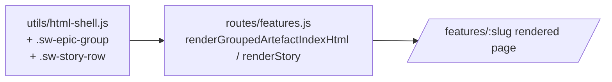

# Design: Feature-detail page UX redesign

**Status:** Draft
**Feature:** 2026-09-05-feature-page-ux-redesign
**Contributors:** Hamish King — Operator/Engineer; Claude Code — agent, operator-directed
**Date:** 2026-09-05
**Prior artefacts:** discovery.md, benefit-metric.md, epics/page-and-nav-redesign.md, stories/fpux.1, stories/fpux.2

---

## Summary

The `/features/:slug` page currently renders two visually unreconciled sections: a top block styled with the platform's existing `.sw-card`/`.sw-section-title` design tokens, and a bottom block (the per-story phase/epic accordion, added by an earlier story) styled with plain, unthemed `
`/`
` elements. This design closes that gap by extending the **existing** token system — not inventing a new one — into two new shared components (`.sw-epic-group`, `.sw-story-row`) that give the accordion the same visual language as the rest of the page: card surfaces, consistent typography, a rotating disclosure chevron, and full light/dark theme and keyboard-focus support. The underlying `html-shell.js` design tokens themselves were reviewed and found already credible against the "Apple/SaaS-tier" bar named in discovery — the defect is that one component never adopted them, not that the token system itself is inadequate.

---

## Solution Architecture

### Overview

No new service, no new data flow. This is a pure presentation-layer change inside the existing `src/web-ui` server: two new CSS component classes are added to the existing shared stylesheet in `src/web-ui/utils/html-shell.js` (the single canonical source for shared styles, per `.github/architecture-guardrails.md`), and `src/web-ui/routes/features.js`'s `renderGroupedArtefactIndexHtml`/`renderStory` functions are updated to emit those classes instead of their current inline `style="..."` attributes.

### Integration points

| System | Interaction type | Direction | Notes |
|--------|-----------------|-----------|-------|
| None | — | — | No new integration point. `_listArtefacts`, `getFeatureStoryStructure`, and `groupArtefactsByStory` (the existing data-fetch path) are unchanged — confirmed out of scope in discovery. |

### Data and state

No data created, read, updated, or deleted beyond what the existing page already fetches. No schema change — no `data-model` diagram is required for this feature.

### Hosting and runtime

Existing service — `src/web-ui`'s raw Node `http.createServer()` process, same as today. No new deployment unit.

### Key technical decisions

| Decision | Choice made | Rationale |
|----------|-------------|-----------|
| Visual-language direction (deferred at discovery/clarify) | **Incremental — extend the existing `html-shell.js` token system**, not a new visual language | Direct review of the existing `.sw-card`/`.sw-section-title` CSS (subtle 1px borders, 8px radius, muted uppercase section labels, accent focus rings) found it already a credible, restrained SaaS aesthetic — the defect is that the accordion component never adopted these tokens, not that the tokens themselves fall short of the "Apple/SaaS-tier" bar. Inventing a second, parallel visual language would itself reintroduce the inconsistency this feature exists to remove. |
| New shared classes vs. one-off inline styles | Add `.sw-epic-group` and `.sw-story-row` to `html-shell.js` | Matches the "single canonical source" architecture guardrail — no page-local `<style>` duplication in `features.js`. |
| Disclosure icon | A CSS-drawn chevron (border-triangle or a plain `▸`/`▾` character), rotated via `transform` on `[open]` | Avoids adding an icon font or library dependency — consistent with `product/constraints.md`'s "no CSS framework" constraint and the existing codebase's dependency-free CSS approach. |

### Non-functional requirements

| Requirement | Target | Source |
|-------------|--------|--------|
| WCAG 2.1 AA contrast | 4.5:1 normal text, 3:1 large text/UI components, in both light and dark theme | `product/constraints.md` #9, benefit-metric M4 |
| Keyboard operability | `
` elements (native semantics, already keyboard-operable by default) must show a visible focus ring matching `.sw-input:focus`'s existing `outline: 2px solid var(--accent)` convention | fpux.1 AC3 |
| No framework dependency | Hand-authored CSS only | `product/tech-stack.md` |

---

## UX / Interaction Design

### Entry point

Unchanged by this design — a user reaches `/features/:slug` via the dashboard, a product page, or a story's own DoD link (audited separately by `fpux.2`, a routing-correctness concern, not a visual one).

### Primary flow

1. User opens `/features/:slug` for a multi-story feature.
2. The feature-level artefact list renders at the top, exactly as today, using existing `.sw-card`/`.sw-section-title` styling — unchanged.
3. Below it, each phase/epic renders as an `.sw-epic-group` — a card-surfaced container (`background: var(--surface)`, `border: 1px solid var(--line)`, `border-radius: 8px`, matching `.sw-card`) with a `
` styled like a primary section header (15px, weight 600, `color: var(--ink)`, not the muted uppercase treatment reserved for `.sw-section-title` subordinate labels) and a chevron that rotates 90° on `[open]`.
4. Inside each epic group, each story renders as an `.sw-story-row` — an indented, list-style row (matching `.sw-list li`'s existing divider convention: `border-top: 1px solid var(--line)` between rows, no border on the first) with its own `
` at 14px/weight 500 (matching `.sw-frow-title`'s existing convention in `features-view.js`) and its own smaller chevron.
5. Expanding a story reveals its own artefact list, rendered via the existing (unchanged) `_renderArtefactListByType` — the content inside each disclosure is untouched; only the disclosure's own chrome changes.

### Edge cases and error states

| Scenario | User-facing behaviour |
|----------|-----------------------|
| A phase/epic has zero stories with artefacts | Existing behaviour is unchanged — `renderStory` already returns `''` for a story with no artefacts, and `renderGroupedArtefactIndexHtml`'s epic block already skips rendering when `storiesHtml` is empty. This design does not alter that logic, only the chrome around groups that do render. |
| A feature has exactly 0 or 1 real stories | Unchanged — `renderArtefactIndexHtml` (the original, non-grouped renderer) is used instead, per the existing `totalStoryCount > 1` branch in `features.js`. This design touches only the grouped (`renderGroupedArtefactIndexHtml`) path. |
| Very long epic/story names | `
` text wraps normally (no `white-space: nowrap` is introduced) — consistent with how `.sw-section-title` and `.sw-frow-title` already handle long text today. |

### Design system

**Reused:** `.sw-card` surface/border/radius convention, `.sw-list` divider convention, `.sw-frow-title` typography scale, `--accent` focus-ring convention (from `.sw-input:focus`), full existing light/dark theme token set (`--ink`, `--muted`, `--surface`, `--line`, `--bg`).

**New (to be added to `html-shell.js`):** `.sw-epic-group` (card-styled `
` wrapper for a phase/epic), `.sw-story-row` (list-row-styled `
` wrapper for a story), plus their respective `
` and chevron treatments described above. Both are genuinely new class names, but zero new *tokens* (colors, radii, spacing units) — every value they reference already exists in the `:root`/`[data-theme]` blocks.

### Accessibility

**Target:** WCAG 2.1 AA, per `product/constraints.md` #9 and benefit-metric M4.
- `
`/`
` is native, semantic, and keyboard-operable by default (Tab to focus, Enter/Space to toggle) — no ARIA role overrides needed.
- Visible focus indicator required on every `
` (currently absent in the plain inline-styled version) — added via the existing `--accent` outline convention.
- Chevron rotation is a pure CSS `transform` on `[open]` — no JavaScript state, so it cannot desync from the actual open/closed state and needs no `aria-expanded` management (native `
` handles this correctly for assistive technology automatically).
- Contrast: all new class colors are token references (`var(--ink)`, `var(--muted)`, `var(--line)`, `var(--surface)`), so they inherit the same light/dark contrast guarantees as the rest of the page — no new literal color values are introduced.

---

## Constraints

- `product/tech-stack.md`: no CSS framework, raw hand-authored CSS in `html-shell.js`.
- `product/constraints.md` #9: WCAG 2.1 AA is a hard floor.
- `.github/architecture-guardrails.md`: `html-shell.js` is the single canonical source for shared styles — no page-local duplication in `features.js`.

---

## Open questions

| # | Question | Owner | Blocking definition? |
|---|----------|-------|----------------------|
| 1 | Should the chevron be a CSS border-triangle or a Unicode glyph (`▸`)? | Hamish King | No — either satisfies all ACs; can be decided at implementation time without affecting story scope. |

---

## Deferred decisions

- **A platform-wide icon system** (beyond this one chevron) — deferred; out of scope per discovery, no other icon needs identified in this feature.
- **Automated visual-regression tooling (Playwright screenshot diffing) for `.sw-epic-group`/`.sw-story-row`** — deferred to `/definition-of-ready`'s own CSS-layout-dependent AC classification step (per `CLAUDE.md`), not decided here.
