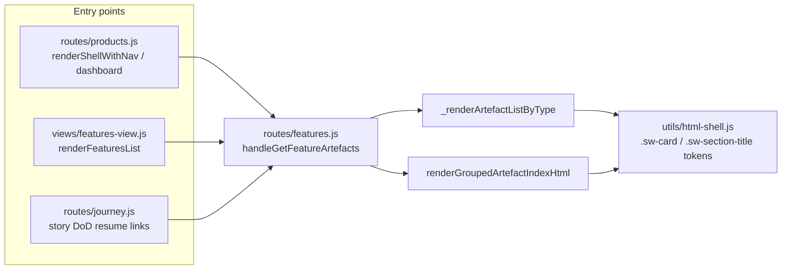

## Epic: An operator or prospect reading a feature's artefact page sees one coherent, modern design end-to-end, and can reach it without a confusing hop

**Discovery reference:** artefacts/2026-09-05-feature-page-ux-redesign/discovery.md
**Benefit-metric reference:** artefacts/2026-09-05-feature-page-ux-redesign/benefit-metric.md
**Slicing strategy:** Vertical slice — each story is a thin, independently complete, independently demo-able slice (the page's own visual language; the paths that lead to it). Chosen over walking skeleton (no new architecture/integration to prove first) and risk-first (no significant technical unknowns — this is a rendering/CX-layer fix within an existing, working system, not new infrastructure). User journey was considered, since a prospect's actual path is "navigate in, then read the page," but the two concerns are independently shippable and independently measurable (Metrics 1/2/4 vs. Metric 3), so vertical slice better reflects that they don't need to land in sequence.

**Architecture constraints scan performed:** `.github/architecture-guardrails.md` read in full. Relevant findings:
- **`html-shell.js` is the single canonical source** for shared HTML-shell functions and CSS design tokens (`--ink`, `--muted`, `--surface`, `--line`, light/dark theme blocks) — any new or extended styling for the epic/story accordion must be added there, not duplicated as page-local inline `<style>` in `features.js`.
- **Anti-pattern: "Ad-hoc cross-cutting surface changes without a story (shadow changes)"** — any change to shared surface modules (`html-shell.js`, design tokens, navigation structure, shared CSS) requires a story, even a small one. This epic exists precisely to satisfy that — confirmed no shell/token change here can bypass this artefact chain.
- `.github/standards/ui/ui-standards.md` exists but is unfilled placeholder boilerplate (references React/Zustand, not this repo's actual raw-Node/hand-authored-CSS stack) — not treated as authoritative; the two directionally-applicable lines ("no inline styles outside the design token set", "no hardcoded colours/spacing outside the token set") are already covered by the `html-shell.js` canonical-source constraint above.
- No regulated compliance framework (PCI-DSS, GDPR, HIPAA, etc.) appears in the discovery Constraints section — Step 4a (regulated constraint propagation) does not apply to this epic. Accessibility (WCAG 2.1 AA) is tracked as a Tier 3 benefit metric and story-level NFR instead.

## Goal

An operator or a prospective client evaluating the platform during beta opens any feature's `/features/:slug` page and experiences one deliberate, modern visual language from the top of the page to the bottom — including large multi-story features like `2026-06-22-wuce-multi-tenancy` — with no visible seam between the feature-level artefact list and the per-story breakdown. Separately, reaching that page from the dashboard, a product page, or a story's own DoD involves no dead-end or confusing hop, and the real, exhaustive set of entry points into the page is known and confirmed (not assumed).

## Out of Scope

- **Platform-wide design-system overhaul** — other pages (`/features` list, `/dashboard`, `/products/:id`, story detail pages, kanban board) are out of scope even where they share the same dated patterns; this epic fixes the feature-detail page and its direct entry points only. (Per discovery MVP scope.)
- **Backend/data changes** — `getFeatureStoryStructure`, `groupArtefactsByStory`, `_listArtefacts`, and the underlying artefact/story data model are unchanged; this is a rendering/CX-layer epic only. (Per discovery MVP scope.)
- **New functionality** — no new capabilities (inline editing, search/filter within the artefact list, the existing "Board" view toggle) are added. (Per discovery MVP scope.)
- **A materially new visual language beyond the existing token system** — per the discovery's own Clarification log, the visual-language decision was deferred to an optional `/design` pass; since `/design` was not run before this `/definition` session, this epic defaults to the incremental path: extending the existing `html-shell.js` token system to eliminate the seam, not inventing a new visual identity.

## Benefit Metrics Addressed

| Metric | Current baseline | Target | How this epic moves it |
|--------|-----------------|--------|----------------------|
| M1: Visual consistency (style-seam count) | 1 seam (confirmed on `wuce-multi-tenancy`) | 0 seams | Story 1 extends the existing `html-shell.js` token system to the epic/story accordion, eliminating the `.sw-card` → plain-`
` transition |
| M2: Perceived design quality (Apple/SaaS-tier rubric) | Below bar | Pass | Story 1's redesign is reviewed against the 4-point rubric before DoD |
| M3: Navigation path clarity | Not yet established | TBD — set during Story 2 | Story 2 audits and fixes the dashboard/product-page/story-DoD entry points |
| M4 (Tier 3): WCAG 2.1 AA conformance | Not yet audited | 100% | Story 1's AC and NFRs require conformance verification before DoD |

## Stories in This Epic

- [ ] fpux.1 — Unify `/features/:slug`'s visual language across feature-level and per-story sections
- [ ] fpux.2 — Audit and fix the navigation path into `/features/:slug`

## Human Oversight Level

**Oversight:** Medium
**Rationale:** No security/auth/data-model surface is touched (low technical risk), but the outcome is inherently subjective (visual/design quality) and directly tied to a named business risk (beta client churn) — a human review checkpoint at PR before this reaches beta users is warranted, rather than fully autonomous merge.

## Complexity Rating

**Rating:** 2
**Rationale:** Story 2 (nav audit) is well-understood (1); Story 1 (visual redesign within an existing token system) carries some ambiguity — the exact visual outcome that satisfies the subjective Metric 2 bar isn't fully specified in advance, even though the technical approach (extend existing tokens) is clear.

## Scope Stability

**Stability:** Stable
**Rationale:** Both stories map 1:1 to the two MVP scope items confirmed at discovery/clarify (page visual unification; nav-path review), with no open scope questions remaining after `/clarify`.
